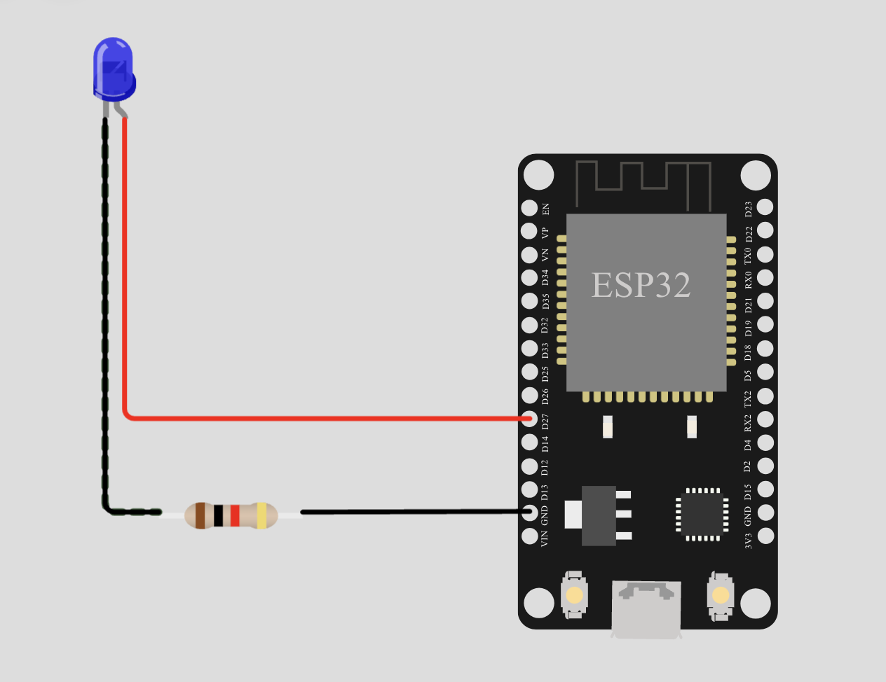

# *Практическое занятие №1*
# UPD: Файл обновлен, см. дополнение после списка литературы.

## **Знакомство со средой моделирования Wokwi. Интерфейс симулятора, основы работы**
____________________

## **Цель работы**

> Целью практического занятия является получение практических навыков работы со средой моделирования и разработки микроконтроллерных модулей цифровых платформ.

_____________________

## **Теоретическая часть**

> На сегодняшний день про платформу Arduino слышали многие. Arduino --- это самая динамично развивающаяся и доступная платформа с низким порогом вхождения, которая доступна как для начинающих и делающих первые шаги в программировании, так и для профессионалов.

### **Возможности**

Платформа Arduino представляет собой комбинацию среды быстрой разработки
Arduino IDE и модулей для прототипирования на базе микроконтроллеров.
Фактически, Arduino это простейший электронный конструктор для
создания готовых устройств из отдельных модулей. Arduino пользуется
огромной популярностью во всем мире из-за контроллеров, модулей и шилдов
(Шилд для Arduino - это разновидность плат расширения, которые состыкуется с
Arduino. Расширяющие функционал шилды, так же, как и
Arduino модули, имеют на своем борту конкретный элемент (драйвер
двигателей, Ethernet контроллер, дисплей и т.п.) со всей необходимой схемотехнической
обвязкой для его работы. В отличии от модулей, которые можно подключить
к произвольным пинам Arduino, выводы шилда, в большинстве случаев,
жестко привязаны к выводам Arduino).

Arduino не просто универсальный микроконтроллер (если быть точнее, плата разработки с микроконтроллером), который можно
адаптировать под любой проект за минимальное время. Это еще и среда разработки Arduino IDE, которая служит для
вовлечения в программирование и робототехнику, а также для быстрой
разработки проектов. На основе Arduino можно собрать различные устройства, а также запрограммировать им собственную логику работы, например алгоритмы измерения. Все это происходит благодаря тому, что у платформы Arduino
одно из самых больших сообществ, а также доступно огромное количество
примеров, руководств и готовых библиотек для разработки.

### **Модули Arduino**

Модули базовых контроллеров Arduino получили широкое распространение
благодаря своей универсальности. Популярные платы Arduino Uno и Leonardo
имеют стандартный набор периферии (его мы рассмотрим на следующих занятиях), а платы Mega и Due - расширенный.
Даже компактные модули типа Pro, Micro и Nano подойдут для собственного
проекта. В последнее время появились модули Mega сразу с установленным
SoC ESP8266 и беспроводной связью Wi-Fi на борту.

Модули Arduino представляют собой платы со встроенным микроконтроллером или процессором,
памятью и периферией, которая позволяет реализовать базовый функционал
посредством одной всего платы. Для расширения возможностей служат
дополнительные модули-шилды, которые работают с двигателями и сенсорами
различных типов, а также способны читать и писать на карты памяти и
накопители, поддерживают USB Host, умеют работать с Ethernet, Bluetooth
и Wi-Fi. Модули расширения уровня Industrial имеют гальваническую
развязку, а модули для умного дома подойдут с целью прототипирования
устройств IoT («интернета вещей»). Некоторые модули достаточно производительны, на них можно реализовать собственный Web-сервер.

На сегодняшний день существует множество оригинальных разновидностей и
популярных клонов, а также огромное количество совместимых
модулей-шилдов. Для прототипирования и обучения доступен огромный
арсенал периферии. Это разнообразные сенсоры, большинство типов датчиков
и исполнительных механизмов, различные дисплеи, буферные и усилительные
модули, драйверы двигателей, модули для беспроводной связи и управления.
Модули комбинируются с основной платой-контроллером и затем
конфигурируются в среде Arduino IDE. Следовательно, такие устройства являются идеальными кандидатами для разработки оконечных устройств сенсорной или цифровой платформы.

Таким образом, устройства, созданные на платформе Arduino можно
использовать для сбора информации об окружающей среде в автономном
режиме, оставляя эту работу группе микроконтроллеров

Отметим, что сама по себе плата разработки не представляет интереса в области цифровых платформ, она рассматривается исключительно как база для какого-либо устройства.
Для начала установим, что под устройством (или его прототипом), будем понимать совокупность аппаратной платформы (платы Arduino), алгоритмической составляющей и программного кода.
При этом алгоритм должен описывать как минимум две части работы устройства - его начальную настройку и основной цикл работы.
Программная часть также повторяет этот принцип. Следовательно, в программе должны присутствовать как минимум две функции: Setup() и Loop().
Обе эти функции по умолчанию имеют тип Void, то есть не возвращают никаких значений. При подаче электропитания на плату разработки первой вызывается функция Setup(), в ней описываются инициализация соединений, сокетов, драйверов и прочих вспомогательных решений.
При условии корректного выполнения начальной настроки вызывается функция Loop(), что в дословном переводе означает "цикл". То есть, эта функция будет выполняться до возникновения ошибки или отключения питания устройства.
Обе эти функции являются "прошивкой" устройства и хранятся в энергонезависимой памяти контроллера, а результаты вычисления наоборот, удаляются при отключении питания.
Помимо этого, возможно использование заголовков, в которых можно глобально задать какие-либо параметры или подключить внешние библиотеки. Пример: `#define LED_BUILTIN 27`, объявленный в начале программы четко определит значение переменной `LED_BUILTIN`.
Далее разберем одну из реализаций симулятора плат разработки Arduino. 

### **Wokwi**
Это онлайн симулятор электронных схем, который
позволяет моделировать ваши микроконтроллерные проекты. Wokwi работает в
браузере, поэтому устанавливать на компьютер ничего не понадобится. Не
потребуется даже никаких аппаратных компонентов.

Данный симулятор позволяет провести моделирование планируемого
устройства, не покупая компонентов и деталей, что позволяет опробировать какие-либо алгоритмы не потратив времени на настройку аппаратной составляющей проекта.

Wokwi имитирует работу популярных плат для прототипирования и обучения
работе с микроконтроллерами, таких как Arduino, ESP32 DevKit, Raspberry
Pi Pico и ряд другиx. Для создания виртуальных электронных схем в
симуляторе присутствуют светодиоды, кнопки, датчики, сервомотор,
динамик, дисплеи, microSD-карта.

Такой набор позволяет не только обучиться основам программирования оконечных устройств цифровых платформ, но и разработать прототип автоматизированного устройства измрения.


_____________________________

## **Практическая часть**

### ***Запуск виртуальной среды***

Как уже было сказано, для работы в среде ничего не нужно устанавливать,
даже регистрация необязательна. Достаточно зайти на сайт
<https://wokwi.com>.

На стартовой странице можно выбрать условия для создания нового проекта.
Создадим новый проект, чтобы поисследовать возможности симулятора. Для
создания доступны платформы Arduino, ESP32, STM32, Pi Pico, но на данном
практическом занятии достаточно использовать лишь одну из них --
подойдёт ESP32. В «Starter Templates» нужно выбрать базовый вариант --
просто ESP32


Рисунок 1 - Стартовая страница среды

### ***Интерфейс симулятора***

При создании нового проекта пользователь увидит следующую картинку.


Рисунок 2 - Новый проект

Слева - текстовый редактор, где можно работать с файлами программы (и
не только), а справа - непосредственно поле симулятора. Сейчас там
только базовая плата. Для того что бы добавить какой-либо элемент
необходимо нажать на кнопку «+» и откроется выпадающий список элементов.

Попробуем создать самый простой пример - всё необходимое для
стандартного примера Blink - светодиод и резистор. Добавим их на
экран, и соединим. Для того, чтобы соединить пины - штыревые разъёмы, и
контакты элементов необходимо просто нажать на один контакт, а затем на
другой.

Светодиоды используются для индикации различных событий в целях
определения статуса работы устройства для корректности его работы. На
этапе начальной разработки любого устройства рекомендуется использовать
больше индикаторов состояний, чем требуется для работы. Так будет
удобнее делать отладку программы.


Рисунок 3 - Подключение новых элементов

После добавления элемента на поле, если навести на него указатель,
появляется рамочка с вопросительным знаком. Нажав на вопросительный знак можно попасть на страницу документации того или иного элемента.

Теперь в левой части окна добавим стандартный пример Blink, не забыв
указать нужный нам пин. Для этого зайдём в документацию светодиода, в
конце страницы есть ссылка на примеры симулятора, в данном случае нужен
«Blink - Arduino\'s standard Blink sketch». Достаточно будет взять код
из открывшегося примера и с помощью #define уточнить, какой вход
используется.

```
#define LED_BUILTIN 27
// the setup function runs once when you press reset or power the board

void setup() {
  // initialize digital pin LED_BUILTIN as an output.
  pinMode(LED_BUILTIN, OUTPUT);
}

// the loop function runs over and over again forever
void loop() {
  digitalWrite(LED_BUILTIN, HIGH);   // turn the LED on (HIGH is the voltage level)
  delay(1000);                       // wait for a second
  digitalWrite(LED_BUILTIN, LOW);    // turn the LED off by making the voltage LOW
  delay(1000);                       // wait for a second
}
```
Запустим симуляцию, нажав на зелёную кнопку «Run».


Рисунок 4 -- Выполнение программы диода

Помимо листа для основной программы «sketch.ino» есть также лист
«diagram.json», предназначенный для того, чтобы можно было менять
настройки элементов. Вот как он выглядит для проекта данного
практического занятия:

```
{
  \"version\": 1,
  \"author\": \"username\",
  \"editor\": \"wokwi\",
  \"parts\": \[

    { \"type\": \"wokwi-esp32-devkit-v1\", \"id\": \"esp\", \"top\": 0,
\"left\": 0, \"attrs\": {} },

    {
      \"type\": \"wokwi-led\",
      \"id\": \"led1\",
      \"top\": -19.33,
      \"left\": -223.8,
      \"attrs\": { \"color\": \"red\" }
    },

    {
      \"type\": \"wokwi-resistor\",
      \"id\": \"r1\",
      \"top\": 147.56,
      \"left\": -174.01,
      \"attrs\": { \"value\": \"1000\" }
    }

  \],

  \"connections\": \[
    \[ \"esp:TX0\", \"\$serialMonitor:RX\", \"\", \[\] \],
    \[ \"esp:RX0\", \"\$serialMonitor:TX\", \"\", \[\] \],
    \[ \"esp:GND.2\", \"r1:2\", \"black\", \[ \"h0\" \] \],
    \[ \"led1:C\", \"r1:1\", \"green\", \[ \"v0\" \] \],
    \[ \"esp:D27\", \"led1:A\", \"green\", \[ \"h0\" \] \]
  \],

  \"dependencies\": {}
}
```

Чаще всего, редактировать придётся объекты, содержащиеся в блоке parts - это описание элементов и в блоке connections - это описание проводов соединений.

Какие атрибуты можно менять у светодиода и резистора? Об этом можно почитать в документации. Вызов документации происходит после нажатия знака "?", при наведении на отдельный элемент, помещенный на поле симулятора.
Пока заменим у светодиода явно заметный параметр - цвет (Также вызывается при нажатии на добавленный диод).

Кроме этого изменим цвет проводов на соответствующий общепринятым: те,
что идут к земле сделаем чёрными, а те, что к питанию (в нашем случае, к
пину 27), красными.

И тогда файл проекта будет таким:
```
{
  \"version\": 1,
  \"author\": \"username\",
  \"editor\": \"wokwi\",
  \"parts\": \[

    { \"type\": \"wokwi-esp32-devkit-v1\", \"id\": \"esp\", \"top\": 0,
\"left\": 0, \"attrs\": {} },

    {
      \"type\": \"wokwi-led\",
      \"id\": \"led1\",
      \"top\": -19.33,
      \"left\": -223.8,
      \"attrs\": { \"color\": \"blue\" }
    },

    {
      \"type\": \"wokwi-resistor\",
      \"id\": \"r1\",
      \"top\": 147.56,
      \"left\": -174.01,
      \"attrs\": { \"value\": \"1000\" }
    }

  \],

  \"connections\": \[
    \[ \"esp:TX0\", \"\$serialMonitor:RX\", \"\", \[\] \],
    \[ \"esp:RX0\", \"\$serialMonitor:TX\", \"\", \[\] \],
    \[ \"led1:C\", \"r1:1\", \"black\", \[ \"v0\" \] \],
    \[ \"r1:2\", \"esp:GND.2\", \"black\", \[ \"v0\" \] \],
    \[ \"led1:A\", \"esp:D27\", \"red\", \[ \"v0\" \] \]
  \],

  \"dependencies\": {}
}
```
А выглядеть будет так.


Рисунок 5 - Стандартизированный вид подключения

Кроме атрибутов у всех объектов можно менять местоположение в
координатах. Это помогает сделать более наглядную модель, с которой удобно
работать.

Теперь сделаем ввод информации в контроллер. Пусть это будет кнопка. При
считывании кнопки значение HIGH соответствует нажатию, а LOW -- его
отсутствие. Требуется сначала добавить кнопку, подключить к ней провода:
1.l или 1.r к одному из входов основной платы, 2.l или 2.r к земле.
Также нужно сконфигурировать пин на контроллере как вход для приёма
данных. Осталось написать программу для выполнения по нажатию

```cpp
#define LED_BUILTIN 27
#define input 26

int program(){
  digitalWrite(LED_BUILTIN, HIGH);   // turn the LED on (HIGH is the voltage level)
  delay(1000);                       // wait for a second
  digitalWrite(LED_BUILTIN, LOW);    // turn the LED off by making the voltage LOW
  delay(1000);                       // wait for a second  
  return 0;
}

// Переменная для хранения состояния кнопки
int buttonState = 0;

void setup() {
  pinMode(LED_BUILTIN, OUTPUT);
  pinMode(input, INPUT); //конфигурация пина, относящегося к кнопке, на вход
}

void loop() {
  buttonState = digitalRead(input);
  if (buttonState == HIGH){
    program();
    }
}

```


Рисунок 6 - Подключение кнопки

### ***Библиотеки и модули***

Для пользователя доступны множество библиотек и функций, готовых к
работе. Это библиотеки для элементов доступных в симуляторе - таких
как NeoPixel или семисегментный индикатор. Для ESP32 доступна
возможность подключения к интернету и к MQTT брокеру.

На сайте <https://docs.wokwi.com/guides/esp32> можно увидеть больше
примеров и подробностей использования плат в рамках симулятора.

На сайте доступно много примеров по работе с библиотеками на примере
Arduino:


Рисунок 7 -- Один из примеров применения доступных инструментов

## **Варианты выполнения задания**

Вариант выполнения задания определяется остатком от деления номера
студента внутри списка группы на 3.

| Вариант        | 0               | 1               | 2               |
|----------------|-----------------|-----------------|-----------------|
|Светодиод 1     | Цвет: жёлтый    | Цвет: зеленый   | Цвет: синий     |
|                |Цвет соединения на питение - черный| Цвет соединения на питание - желтый | Цвет соединения на питание - черный| 
|                |Цвет соединения на землю - белый   | Цвет соединения на землю - оранжевый | Цвет соединения на землю - желтый |
|Светодиод 2     | Цвет: оранжевый | Цвет: белый     | Цвет: фиолетовый|
|                |Цвет соединения на питение - зеленый| Цвет соединения на питание - фиолетовый | Цвет соединения на питание - синий| 
|                |Цвет соединения на землю - фиолетовый| Цвет соединения на землю - оранжевый | Цвет соединения на землю - голубой (cyan) |
|Кнопка 1        | Действие при нажатии: включить диод №1, выключить диод №2| Действие при нажатии: включить диод №1| Действие при нажатии: включить диод №1 |
|Кнопка 2        | отсутствует                                              | Действие при нажатии: включить диод №2| Действие при нажатии: отключить диод №1|
|Дополнительные условия| Диод №2 по умолчанию включен                       | Диоды по умолчанию выключены          | Диод №2 по умолчанию включен           |

## **Задание**

Используя полученную информацию, создайте проект со светодиодами и
кнопками, подключёнными к плате ESP32. Светодиоды и кнопки могут иметь
общую землю. Варианты программ для кнопок сделайте в соответствии с
вариантом. Попробуйте изменить период мигания светодиода.

## **Список рекомендуемой литературы**

1.  [Документация микроконтроллера ESP32 Wokwi](https://docs.wokwi.com/guides/esp32)

2.  [Рощупкин Э. В. Моделирование и отладка режимов работы информационно-измерительных систем экологического мониторинга на микроконтроллерах //Известия Тульского государственного университета. Технические науки. – 2010. – №. 2-2. – С. 147-152.](https://cyberleninka.ru/article/n/modelirovanie-i-otladka-rezhimov-raboty-informatsionno-izmeritelnyh-sistem-ekologicheskogo-monitoringa-na-mikrokontrollerah)

3.  [Цыбин В. В., Хрусталев В. И. Использование микроконтроллеров arduino для мониторинга качества воды //Новое слово в науке: перспективы развития. – 2016. – №. 4-1. – С. 10.](https://interactive-plus.ru/e-articles/292/Action292-116941.pdf)

4.  [Основы программирования Arduino микроконтроллеров](https://habr.com/ru/articles/352806/)


___________________________
___________________________
___________________________
# UPD

Рассмотрим подробнее интерфейс симулятора Arduino: в левой части находится программный код (вкладка sketch.ino), описание собранной схемы на языке разметки (diagram.json), и список подключенных библиотек (Library Manager), а в правой - интерфейс добавления различных модулей, соединения их с основной платой и графическое отображение получившейся схемы.


В первой вкладке находится непосредственно программный код разрабатываемого устройства. Он описывает алгоритм работы устройства, его отдельные функции, то как устройство будет считывать, обрабатывать или передавать данные с подключаемых датчиков. С этим полем связана основная работа разработчика. При этом программый код должен соответствовать требованиям Arduino, в противном случае можно получить вместо рабочего устройства ряд ошибок, которые укажут строку некорректного кода.

Во второй вкладке описана схема, но не в графическом виде, а в виде языка разметки JSON. Такое описание занимает меньший объем памяти, чем графика, и, иногда, его проще редактировать. Разберемся подробнее в обозначениях этого языка разметки.
В примере с кнопкой имеем следующее описание схемы:


```json
{
  "version": 1,
  "author": "user",
  "editor": "wokwi",
  "parts": [
    { "type": "wokwi-esp32-devkit-v1", "id": "esp", "top": 0, "left": 0, "attrs": {} },
    {
      "type": "wokwi-led",
      "id": "led1",
      "top": -19.33,
      "left": -223.8,
      "attrs": { "color": "blue" }
    },
    {
      "type": "wokwi-resistor",
      "id": "r1",
      "top": 147.56,
      "left": -174.01,
      "attrs": { "value": "1000" }
    },
    {
      "type": "wokwi-pushbutton",
      "id": "btn1",
      "top": 184.87,
      "left": -104.93,
      "attrs": { "color": "green", "bounce": "1" }
    }
  ],
  "connections": [
    [ "esp:TX0", "$serialMonitor:RX", "", [] ],
    [ "esp:RX0", "$serialMonitor:TX", "", [] ],
    [ "led1:C", "r1:1", "black", [ "v0" ] ],
    [ "r1:2", "esp:GND.2", "black", [ "v0" ] ],
    [ "led1:A", "esp:D27", "red", [ "v0" ] ],
    [ "btn1:1.r", "esp:D26", "green", [ "v0" ] ],
    [ "btn1:2.r", "esp:GND.2", "black", [ "h0" ] ]
  ],
  "dependencies": {}
}

```

Сразу обратим внимание, что структура этого кода иерархична и представляет собой дерево. Каждая ветвь этого дерева отделена запятой, а подветвь заключена в квадратные скобки.
Таким образом, структуру этого JSON файла можно представить в следующем виде:

```
---|
   |---version
   |---author
   |---editor
   |---parts
       |---[]
   |---connections
       |---[]
   |---dependencies
       |---{}
```
В строке version хранится значение версии модели, это значение является исключительно описательным элементом, позволяющим разработчику ориентироваться в разных проектах при их большом количестве.
Аналогично и строки author и editor не влияют на графический интерфейс, в первой строке можно указать имя разработчика схема или программного кода, а во втором используемую программу для разработки (в примерах указано User и Wokwi для этих строк)

Далее расположены структуры кода, оказывающие влияние на графическую схему. Первый раздел - parts. В нем указаны все элементы схемы, начиная с платы разработки и заканчивая добавленными разработчиком компонентами. При этом нет разницы для симулятора как именно записать описание элементов: в одну строчку или несколько. Основное требование - каждый отдельный элемент должен находится в фигурных скобках, у него должны быть заполнены основные поля описания: Тип, Идентификатор, Положение на схеме в пикселях от верхней точки, Положение на схеме в пикселях от левого края, атрибуты элемента.

Рассмотрим пример с платой подробнее. Тип показывает что это плата разработки ESP32 `"type": "wokwi-esp32-devkit-v1"`, далее, через запятую следует идентификатор  `"id": "esp"`, расположение элемента на схеме `"top": 0, "left": 0,` и атрибуты `"attrs": {}`. Начало описания платы начинается с открывающей фигурной скобки `{` и заканчивается закрывающей `}`.

В этом же разделе, при описании диода, в атрибутах явно указывается его цвет. Несмотря на недавно появившуюся возможность выбора цвета в графическом интерфейсе ("мышкой" с использованием всплывающих кнопок), стандартным считается именно изменение атрибутов диода для выбора его цвета (аналогично и с соединениями). Это достигается добавлением строки `"attrs": { "color": "blue" }`.
Есть и другие атрибуты элементов, они не являются обязательными и описывают угол поворота элемента при отображении и возможность "спрятать" элемент. Это атрибуты `rotate` и `hide` соответственно. Первый принимает значение угла поворота, например 90, а второй скрывает элемент со схемы при значении `true`.

В примере используются 4 элемента: плата разработки, светодиод, резистор и кнопка. Поэтому и в коде также описаны 4 структуры для каждого элемента. Если опустить содержимое каждой структуры, то код для 4х элементов будет выглядить так :
```json
"parts": [{1}, {2}, {3}, {4}]
```

Следующий раздел - connections, описывает наличие проводных соединений для модулей схемы. Каждое соедиение описывается набором из трех опязательных компонентов и одного необязательного (но последний элемент может содержать несколько аргументов).
Первый компонент - исходная точка подключения. Это указатель на отдельный Pin (разъем на плате). Второй аргумент также указывает на Pin, только уже конечной точки подключения. Третий аргумент - цвет провода, если его не указать, то и провод на схеме не будет отображаться, хотя фактически будет подключен. Такие провода можно увидеть в первых двух строках раздела connections файла diagram.json. Это описание служебных подключений, без которых не будет выводиться информация с платы. Они функционируют, но на схеме их не видно. И наоборот, для некоторых соединений явно указан цвет, например "green" для провода к кнопке.
Последний(ие) атрибуты указывают на то, как именно провод должен отображаться на схеме, точнее на сколько пикселей сместить провод относительно точки подключения, а также требуется ли функция автоподключения провода к компоненту схемы.
Наглядный пример таких атрибутов представлен на анимации ниже:


Последняя структура dependencies описывает возможные зависимости схема от других проектов. К примеру если в одном проекте разработан модуль сбора данных, а в другом отображения данных, и их требуется объединить. Но по факту этот раздел используется достаточно редко.

В последней доступной вкладке пусто. Это происходит поскольку к текущему проекту не подключены никакие программные библиотеки.


Но что могут представлять собой эти библиотеки? По факту в них находится описание того, как именно нужно обращаться к разным сложным компонентам при разработке. К примеру датчик концентрации CO2 разрабатывался для подключения к интерфейсу RS-232, тогда для разработки устройства с этим датчиком в программный код необходимо включать библиотеку для интерфейса RS-232 или предоставляемую производителем датчика программную библиотеку. Без ее использования разработчику придется самостоятельно писать функции взаимодействия с датчиком, что совсем не является оптимальным в ряде случаев. Куда логичнее воспользоваться способом, предложенным производителем датчика.

С развитием симулятор все больше функций, описываемых программно, реализуются в графическом интерфейсе. Но совсем забывать про него не стоит. Например, до сих пор невозможно добавить на схему больше двух плат разработки через графический интерфейс (кнопкой "+"), а вот изменением строчки кода в diagram.json проблем не возникает.

В примере ниже показано как добавить плату разработки Arduino Nano к уже имеющейся ESP32. Это изменение затрагивает только структуру `parts`:

```json
{ "type": "wokwi-esp32-devkit-v1", "id": "esp", "top": 0, "left": 0, "attrs": {} },
    { "type": "wokwi-arduino-nano", "id": "nano", "top": -104.85, "left": -52.42, "attrs": {} },
```

## Основы программирования Arduino

Платы Arduino программируются на собственном языке программирования, но большая его часть заимоствована из языка C++. Любая программа написанная на языке C++ содержит одну или несколько функций. Одна из них обязательная и является точкой входа в программу - то есть выполняется при запуске.

*Функция в программировании — это подпрограмма (именованный участок программы, выполняющий определенные задачи), которую можно вызвать из другого места программы.* Функции в C++ обычно объявляются в формате:

```cpp
<тип возвращаемых данных> <имя функции> (<аргументы, передаваемые функции>)
{
    <команды, выполняемые в рамках функции> ;
    return <результат функции> ;
}
```
При этом каждое значение в <> представляет собой какой-либо операнд или тип данных.

Тип функции (или тип возвращаемых данных) - тип возвращаемого значения; имя функции - имя, по которому вызывается функция; аргументы ­ перечень аргументов, которые функция использует для своих действий; результат функции ­ переменная определяющее возвращаемое значение функции. Любые блоки операторов (в том числе и содержимое функции) выделяются фигурными скобками.

Если функция ничего не возвращает - то используется пустой тип void. Соответственно, в коде функции строка return() не нужна.

Для использование функции в другой части программы к ней производится обращение по ее имени: 
`<имя функции> (<аргументы, передаваемые функции>)`

Ниже представлен пример простой функции, выполняющей суммирование двух чисел:
```cpp
int sum( int a, int b ) // функция sum целочисленного типа int принимает два числа: a и b
{
  int result;    //явно указываем переменную, хранящую значение суммы
  result = a+b;  //присваиваем переменной значение суммы a и b
  return result; // возвращает результат их сложения
}
```

**В случае Arduino в программе обязательно должны быть две функции: setup и loop.** Пустая программа для Arduino выглядит так:
```cpp
void setup() {
  // put your setup code here, to run once:

}

void loop() {
  // put your main code here, to run repeatedly:

}
```

Содержимое функции setup выполняется сразу при включении или перезагрузке платы. Затем постоянно повторяясь выполняется функция loop.

Комментарии в программе позволяют вам оставить свои пометки (для себя или коллег). Комментирование кода - очень полезная привычка, особенно при написании больших программ в команде. Комментарий никак не влияет на компиляцию программы и служит только для хранения уточнений программиста. В ардуино можно комментировать строку (все, что записано после // - это комментарий). Или можно комментировать блок кода (комментарий между символами /* и */)

```cpp
void setup()
{
этот код работает // это комментарий
этот код работает 

/*
это тоже комментарий

*/

этот код работает 

}
```
В этом примере видно, где комментарий написан правильно (серым), а где посчитается за код.

Взглянем на функцию, которую вы запускали ранее еще раз с целью подробного разбора программного кода.
```cpp
#define LED_BUILTIN 27               //В этих строках задаются глобальные переменные, так программа будет знать, что при указании в коде LED_BUILTIN (имя может быть произвольным) - нужно подставить вместо него 27, что указывает на номер разъема, к которому подключен светодиод
#define input 26                     // Аналогично с кнопкой, она подключена к разъему с номером 26

int program(){                       // Создаем новую функцию с именем program
  digitalWrite(LED_BUILTIN, HIGH);   // Эта функция включает светодиод. По факту происходит запись значения HIGH (что является логической единицей) в переменную LED_BUILTIN. Поскольку переменная ссылается на 27 разъем, то устройство фактически подает напряжение на него, что и включает светодиод.
  delay(1000);                       // Функция ожидания, которая принимает на вход время в миллисекундах.
  digitalWrite(LED_BUILTIN, LOW);    // При записи LOW на переменную разъема, на нем устанавливается напряжение 0 Вольт, то есть фактически выключается электропитание - диод гаснет.
  delay(1000);                         
  return 0;                          // Поскольку функция типа Int, то она обязательно должна возвращать значение, в этом примере функция всегда возвращает 0, если функция не возвратила 0, то программа получит сообщение об ошибке
}


int buttonState = 0;                 // Переменная для хранения состояния кнопки

void setup() {                       // Обязательная функция setup
  pinMode(LED_BUILTIN, OUTPUT);      //конфигурация разъема к светодиоду как цифрового выхода
  pinMode(input, INPUT);             //конфигурация разъема, к которому подключена кнопка, как цифровой вход
}

void loop() {                       // Основная повторяемая функция
  buttonState = digitalRead(input); //Чтение значение кнопки и присвоение этого значения переменной buttonState
  if (buttonState == HIGH){         //Если кнопка нажата, в этом примере кнопка подключена к +5 Вольт, ее нажатие создаст на втором разъема такое же напряжение, то есть значение на этом разъеме установится в HIGH
    program();                      //Вызов описанной ранее функции program
    }
}
```
В этом коде появился еще не знакомый оператор `if`. Если в программе нужно выполнять разные команды в зависимости от условия (например, включить обогрев если температура ниже 20 градусов) - необходимо использовать оператор условия if.


Оператор if позволяет проверять условие и в зависимости от результата выполнять различные блоки кода. Соответственно состоит из проверяемого условия, операторов выполняемых при выполнении условия и операторов, выполняемых в обратном случае.

Структура условия:
```
if ( <условие> )  { <оператор, выполняемый при верном условии> ; }

else {<оператор, выполняемый при НЕверном условии> ; }
```
 

Блок `else { }` можно опустить, он не обязателен.
Рассмотрим простой пример применения if-else:
```cpp
if (x<10) // условие (значение переменной x меньше 10)
 {y++;} // при выполнении условия значение y увеличится
else 
 {y--;} // если же условие неверно – то уменьшится 
 ```

 Такой оператор условия идеально подходит под задание практического занятия - управление светодиодом. Рассмотрим пример, при  нажатой кнопке необходимо увеличивать частоту мигания светодиодом.

```cpp
int led = 2; // 2й пин – светодиод
int key = 8; // 8й - кнопка
int time = 1000; // time – переменная для времени мигания

void setup() {                
  pinMode(led, OUTPUT);     
  pinMode(key, INPUT);     
}

void loop() {
  if (digitalRead(key)==HIGH) // если ключ нажат (сигнал = 5В)
	{time = 100;} // то время=100 мс.
 	else {time = 1000;} // иначе время=1000 мс.

  digitalWrite(led, HIGH);   
  delay(time);               
  digitalWrite(led, LOW);    
  delay(time);              
}
```

if-else поддерживает и вложенные условия, они выполняются последовательно. Но для таких случаев можно использовать и другие операторы C++. Например оператор выбора `switch`, который позволяет проверять значение переменной и выполнить одно из действий, в зависимости от значения переменной. Оператор используется тогда, когда в зависимости от значения переменной программа должна вести себя по разному (3 и более варианта поведения).

Структура кода с использованием `switch` показана ниже:
```cpp
switch ( <проверяемая переменная> )
  {
  case <значение переменной> :
    <оператор, выполняемый при совпадении значения> ;
    break; //описание break представлено ниже
  default:
    <оператор выполняемый, если ни одно значение не подошло> ;
    break;
  }
```
```cpp
switch (val) // проверяется переменная val
  {
  case 5:
    x+=100; // если val==5 то x+=100
    break;
  default:
    x+=10; // если ни одно условие не подошло – то  x+=10
    break;
  }
```
Стоит отметить особенность выполнения команд в `switch`:  Когда `case` совпал (или выполняется `default`), то выполнение начинается с первой команды, которая находится после соответствующего `case` и продолжается до тех пор, пока не будет выполнено одно из следующих условий завершения: достигнут конец блока `switch` или выполняется оператор прерывания блока кода `break/` `goto/` `return`. Если нет команды `break`, то выполняться будут все кейсы после того `case`, который совпал с выражением `switch`. 

Где этот оператор можно применить? Представим ситуацию, в которой нужно отображать разную индикацию при различных событиях. К примеру требуется контроль за температурой в определенном помещении. При температуре +4 градуса Цельсия и ниже индикации быть не должно, при +6 требуется включить один диод, при +8 второй, а при +10 и выше третий. В этом случае может использоваться оператор `switch`. 

Если упростить условие убрав датчик температуры, то в этом можно убедиться наглядно.

Соберите схему, аналогичную рисунку ниже. Вам потребуется ESP32, три светодиода и потенциометр (на рисунке тип Slide). Этот потенциометр при работе программы (после нажатия кнопки Run), можно передвигать, тем самым меняя его значение.


Теперь используйте программный код ниже, после его выполнения постарайтесь разобраться почему он работает именно так (коментарии в этом коде намеренно опущены).

```cpp
int led1 = 21; int led2 = 19; int led3 = 18; // светодиоды
int datapin = 34; // 34 пин потенциометра

int val = 0;
void setup() {     
  Serial.begin(9600);           
  pinMode(led1, OUTPUT);
  pinMode(led2, OUTPUT); 
  pinMode(led3, OUTPUT); 
}
void loop() {
  val = 0;
  if (analogRead (datapin) > 600){ val = 1;}
  if (analogRead (datapin) > 1000){ val = 2;}
  if (analogRead (datapin) > 2000){ val = 3;}
  Serial.println(analogRead (datapin));
  Serial.println(val);
  switch (val)
  {
  case 1: 
    digitalWrite(led1, HIGH);   break;
  case 2:
    digitalWrite(led2, HIGH);	break;
  case 3: 
    digitalWrite(led3, HIGH); break;
  default:
    digitalWrite(led1, LOW);
    digitalWrite(led2, LOW);
    digitalWrite(led3, LOW);
    break;
  }
}
```
