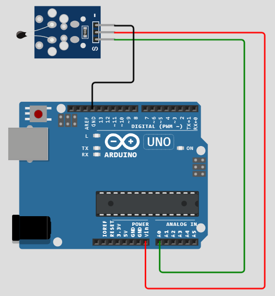

# Практическое занятие №3

# Составные части цифровых платформ Arduino. Микроконтроллерные модули, шины данных и их использование. 

## Цель работы

Целью практического занятия является получение практических навыков
взаимодействия с разнородными выносными датчиками микроконтроллерных
модулей в составе цифровых платформ экологического и метеорологического
мониторинга.

## Теоретическая часть

Поскольку основными функциями устройств на базе микроконтроллерных
модулей в рамках разработки цифровых платформ для экологического и
метеорологического мониторинга являются сбор и передача данных об
измерениях, то такие устройства должны обладать возможностью подключения
внешних сенсоров или датчиков. Помимо этого, стоит предварительно
предусмотреть возможность кратковременного или долговременного хранения
значений проведенных измерений. За это в микроконтроллерах отвечает
встроенная подсистема памяти. Память бывает энергозависимой и
энергонезависимой.

Энергозависимая память хранит моментальные значения параметров, в том
числе системных. После выключения питания устройства эта память
«обнуляется», ее содержимое не будет доступно при следующем включении.
Другое название этой памяти - оперативная. На примере микроконтроллера
платы Arduino Uno - ATMega 328p, объем оперативной памяти составляет 2
кб.

Второй тип памяти, представленный в микроконтроллерах -
энергонезависимая память. При этом она делится на две возможные
реализации: флэш-память и EEPROM. Первая используется для хранения
исполняемого программного кода и составляет 32 кб. Вторая опционально
присутствует на платах, ее размер не столь велик, для Uno составляет 1
кб. Но этого значения вполне хватает для хранения пользовательских
настроек или других данных, которые необходимо иметь при включении
устройства.

Помимо наличия встроенной памяти, для подключения датчиков нужно
предусмотреть наличие портов ввода-вывода. В платформах Arduino, в
зависимости от типа платы и ее реализации возможно наличие аналоговых и
цифровых портов ввода вывода. Отдельно отмечают порты для подачи
электропитания: «плюса» и «минуса» для подключения источника постоянного
тока.

Несмотря на то, что на плате множество различных элементов,
взаимодействовать мы можем только с тремя их группами: пины питания
(`GND, 5V, 3.3V, Vin, IOREF, RESET`), аналоговые пины (`A0-А5`) и цифровые
пины (`1-13`).

## Чем отличается аналоговый сигнал от цифрового

**Аналоговый сигнал** непрерывно изменяется во времени. Вся информация в
природе аналоговая - волны на воде, колебание струны и т.д. Изначально
человек записывал информацию (звуки, изображения, видео) с помощью
аналоговых устройств. Но аналоговые сигналы чувствительны к воздействию
шумов и помех.

**Цифровой сигнал** передается в виде единиц и нулей, для компьютеров и
цифровой техники это проще реализовать (есть сигнал или нет сигнала).
Для оперативной памяти в компьютерах используют конденсаторы, один
заряженный конденсатор - 1 бит. На флеш-памяти используют транзисторы
с плавающим затвором.

Аналоговый сигнал - это сигнал, который может принимать любое
количество значений, в отличие от цифрового сигнала, который имеет
только два значения: высокий и низкий. Для измерения значения аналоговых
сигналов в Arduino имеется встроенный аналого-цифровой преобразователь
(АЦП). АЦП преобразует аналоговое напряжение в цифровое значение.
Функция, которая используется для получения значения аналогового
сигнала: analogRead(pin). Данная функция преобразует значение напряжения
на аналоговом входном выводе и возвращает цифровое значение от 0 до
0123, относительно опорного значения. Для большинства Arduino опорное
напряжение составляет 5В, 7В для
Arduino [Mini](https://radioprog.ru/shop/merch/8) и [Nano](https://radioprog.ru/shop/merch/10),
и 15В для [Arduino Mega](https://radioprog.ru/shop/merch/1). Она
принимает лишь один параметр: номер вывода.

Arduino не содержит встроенного цифро-аналогового преобразователя (ЦАП),
но она может использовать цифровой сигнала с широтно-импульсной
модуляцией (ШИМ) для реализации функций по работе с аналоговым выходом.
Функция, используемая для вывода ШИМ сигнала: `analogWrite(pin,
value)`. `pin` - это номер вывода, используемого для ШИМ выхода. `value` -
это число, пропорциональное коэффициенту заполнения сигнала. Когда `value = 0`, на выходе всегда логический ноль. Когда `value = 255`, на выходе
всегда логическая единица. На большинстве плат Arduino, ШИМ функции
доступны на выводах 3, 5, 6, 9, 10 и 11. Частота ШИМ сигнала на
большинстве выводов составляет примерно 490 Гц.
На [Uno](https://radioprog.ru/shop/merch/2) и подобных платах выводы 5 и
6 работают на частоте примерно 980 Гц. Выводы 3 и 11
на [Leonardo](https://radioprog.ru/shop/merch/3) также работают честоте
на 980 Гц.

Чтобы сопоставить аналоговое входное значение, которое находится в
диапазоне от 0 до 1023, с выходным ШИМ сигналом, который находится в
диапазоне от 0 до 255, вы можете использовать функцию `map(value, fromLow, fromHigh, toLow, toHigh)`. Данная функция имеет пять параметров:
в первом хранится аналоговое значение, а остальные равны соответственно
0, 1023, 0 и 255.

Но для чего тогда используется цифровой сигнал, если его значение могут
принимать только 0 и 1? Два значения не смогут точно передать состояние
какого-либо датчика. Но здесь в ход вступают характеристики этих самых
цифровых датчиков. Большинство из них имеют параметр «разрядность»
больше 10 бит. Профессиональные датчики при этом в аналогичном параметре
имеют значение 12-16 бит, а бытовые - от 8. Для примера возьмем меньшее
значение - 8 бит.

Это означает, что за один опрос датчик отправит 8 бит данных,
описывающих его текущее состояние, т.е. фактически значение измеряемого
параметра. А количество возможных значений составит 2^8^, или 256
значений. Конечно же это крайне скромное значение, и оно не может
показывать точные результаты измерений, погрешность таких датчиков как
правило высока. Но уже при значении разрядности в 10 бит - возможных
значений сенсора уже 1024, что для температурного датчика при точности
0,1 градус Цельсия позволит использовать диапазон значений более 102
градусов.

При этом основная проблема не только в разрядности этого датчика, но и в
интерфейсе его подключения, а значит и взаимодействия с ним. Если датчик
является просто «цифровым», то он будет выдавать значение указанной
разрядности и прочитать их на плате не составит труда. Но известны
реализации датчиков (как правило профессионального сегмента), имеющих
реализацию одного из протоколов взаимодействия с микроконтроллером,
например SPI или I^2^C. Такой датчик не будет инициировать отправку
данных самостоятельно, тем более, будет отвечать на опрос
микроконтроллера только при известном адресе датчика.

Для взаимодействия с такими датчиками используются программные
библиотеки - специальные модули от производителя датчика или платы
прототипирования для облегчения работы разработчика устройств. Эта
библиотека скрывает (если быть точнее, абстрагирует) все этапы протокола
взаимодействия от разработчика, оставляя лишь функции управления,
например, функцию опросить датчик, функцию выключить питание датчика,
включить питание датчика и т.д. Именно такой подход будет использоваться
в рамках этого практического занятия.

## Названия контактов (портов ввода-вывода)

Контакты от 0 до 13 являются цифровыми контактами GPIO (типовое название
кастомизируемых портов ввода вывода, англ. General Purpose Input
Output). Контакты от A0 до A5 служат в качестве аналоговых входных
контактов, а также являются цифровыми контактами GPIO.

Имеется три контакта заземления: GND.1, который находится вверху платы,
рядом с контактом 13, и GND.2/GND.3, которые находятся внизу.

Выводы VIN/5V подключены к плюсовому источнику питания.

Выводы 3.3V/IOREF/AREF/RESET в симуляции недоступны.

Цифровые контакты 3, 5, 6, 9, 10 и 11 имеют аппаратную поддержку ШИМ
(Широтно-импульсная модуляция - процесс управления мощностью методом
пульсирующего включения и выключения прибор, в рамках данного
практического занятия эта технология не будет задействована).

***Встроенные светодиоды***

На плате имеется четыре светодиода:

-   Функция светодиода

-   L Подключен к цифровому контакту 13.

-   RX Последовательный прием

-   TX Активность последовательной передачи

  |**Светодиод**| **Особенность**|
  |-------------|----------------|
  |L|Подключен к цифровому контакту 13|
  |RX|Последовательный прием данных|
  |TX|Последовательная передача данных|
  |ON|Светодиод питания. Всегда включен во время моделирования|

Как правило, кодом пользователя можно управлять только светодиодом «L».
Вы можете использовать константу LED_BUILTIN для ссылки на нее из вашего
кода:

```cpp
pinMode(LED_BUILTIN, OUTPUT) ; // назначение пина L в качестве выходного
digitalWrite(LED_BUILTIN, HIGH); // подача высокого напряжения, на светодиод, что приводит к его загоранию
```


Рисунок 1 - плата Arduino Uno

1.  МК AVR ATMega328P-PU

2.  МК AVR ATMega8U2

3.  Встроенный керамический резонатор на 16 МГц

4.  ISP разъем для внутрисхемного программирования

5.  USB порт для подключения к PC и загрузки программ

6.  Разъем для подключения внешнего питания (может питаться от USB)

Основу работой с Arduino составляет подключение и обмен информацией с
подключаемыми модулями. Метеорологические и экологические платформы, в
частности, оконечные устройства цифровых систем мониторинга зачастую
имеют в своем составе ряд датчиков, температуры, влажности воздуха,
скорости ветра, концентрации различных веществ и другие. Все эти датчики
подключаются с использованием стандартных протоколов и технологий,
которые будут рассмотрены в ходе практического занятия.

**Практическая часть**

***Запуск виртуальной среды***

Как уже было сказано, для работы в среде ничего не нужно устанавливать,
даже регистрация необязательна. Достаточно зайти на сайт
<https://wokwi.com>.

На стартовой странице можно выбрать условия для создания нового проекта.
Создадим новый проект, чтобы поисследовать возможности симулятора. Для
создания доступны платформы Arduino, ESP32, STM32, Pi Pico. В качестве
основного рекомендуется использовать плату Arduino.

Перед рассмотрением работы в симуляторе следует оговориться, как это
работает с физической платой: Библиотеки для тех или иных устройств
устанавливаются в компиляторе Arduino, которые содержат в себе всё, что
необходимо для работы с тем или иным устройством. При компиляции
приложение описывает программу, используя то, что заложено в этих
библиотеках, интерпретируя основной код, вводимый пользователем

***Температурный датчик DHT22 (Температура и влажность)***

Рассмотрим первый температурный датчик. Для просмотра примера, как с ним
работать, можно воспользоваться ссылкой на статью устройства в виде
знака вопроса рядом с датчиком. В конце статьи приводится ссылка на
пример реализации устройства.


Рисунок 2 - Температурный датчик DHT22

Содержание вкладки libraries.txt:

DHTlib

Содержание вкладки diagram.json:

```json
{
  \"version\": 1,
  \"author\": \"User\",
  \"editor\": \"wokwi\",
  \"parts\": \[
    { \"type\": \"wokwi-arduino-uno\", \"id\": \"uno\", \"top\": 160,
\"left\": 20, \"attrs\": {} },
    { \"type\": \"wokwi-dht22\", \"id\": \"dht\", \"top\": 0.67,
\"left\": 70, \"attrs\": {} }
  \],
  \"connections\": \[
    \[ \"uno:GND.1\", \"dht:GND\", \"black\", \[ \"v-20\", \"\*\",
\"v5\" \] \],
    \[ \"uno:5\", \"dht:SDA\", \"green\", \[ \"v-16\", \"\*\", \"h0\" \]
\],
    \[ \"uno:5V\", \"dht:VCC\", \"red\", \[ \"v20\", \"\*\", \"h0\" \]
\]
  \],
  \"dependencies\": {}
}
```

Содержание вкладки основной программы с комментариями:

```cpp
#include \<dht.h\> // Подключение программной библиотеки для датчиков типа dht

dht DHT; // Создание объекта DHT типа dht, используется в дальнейшем для обращения к датчику

#define DHT22_PIN 5 // Определение  номера разъема основной платы, который используется для связи с устройством

struct { // Определение переменных, используемых для программы считывания температуры
  uint32_t total;
  uint32_t ok;
  uint32_t crc_error;
  uint32_t time_out;
  uint32_t connect;
  uint32_t ack_l;
  uint32_t ack_h;
  uint32_t unknown;
} stat = { 0, 0, 0, 0, 0, 0, 0, 0};

void setup() { //Функция начальной настройки платы разработки
  Serial.begin(115200); //Включение функции обмена данными с ПК
  Serial.println(\"dht22_test.ino\"); //Печать в терминал ПК строки
  Serial.print(\"LIBRARY VERSION: \");
  Serial.println(DHT_LIB_VERSION);
  Serial.println();

  Serial.println(\"Type,\\tstatus,\\tHumidity (%),\\tTemperature
(C)\\tTime (us)\"); //Вывод данных датчика в терминал ПК
}

void loop() {    // Основное тело программы по считыванию информации с устройства

  Serial.print(\"DHT22, \\t\");
  uint32_t start = micros();        //Программа из библиотеки DHTlib для DHT22

  int chk = DHT.read22(DHT22_PIN);  //Считывание сигнала на пине 5
  uint32_t stop = micros(); //Завершение опроса датчика
  stat.total++;
  switch (chk)
  {
    case DHTLIB_OK: //Вывод состояние устройства
      stat.ok++;
      Serial.print(\"OK,\\t\");
      break;
//Строки ниже - обработка ошибок датчика через оператор switch

    case DHTLIB_ERROR_CHECKSUM:
      stat.crc_error++;
      Serial.print(\"Checksum error,\\t\");
      break;
    case DHTLIB_ERROR_TIMEOUT:
      stat.time_out++;
      Serial.print(\"Time out error,\\t\");
      break;
    case DHTLIB_ERROR_CONNECT:
      stat.connect++;
      Serial.print(\"Connect error,\\t\");
      break;
    case DHTLIB_ERROR_ACK_L:
      stat.ack_l++;
      Serial.print(\"Ack Low error,\\t\");
      break;
    case DHTLIB_ERROR_ACK_H:
      stat.ack_h++;
      Serial.print(\"Ack High error,\\t\");
      break;
    default:
      stat.unknown++;
      Serial.print(\"Unknown error,\\t\");
      break;
  }

  // Отображение данных
  Serial.print(DHT.humidity, 1);
  Serial.print(\",\\t\");
  Serial.print(DHT.temperature, 1);
  Serial.print(\",\\t\");
  Serial.print(stop - start);
  Serial.println();
  if (stat.total % 20 == 0) //Отображение статистики каждые 20 итераций опроса
  {
   
    Serial.println(\"\\nTOT\\tOK\\tCRC\\tTO\\tCON\\tACK_L\\tACK_H\\tUNK\");
    Serial.print(stat.total);
    Serial.print(\"\\t\");
    Serial.print(stat.ok);
    Serial.print(\"\\t\");
    Serial.print(stat.crc_error);
    Serial.print(\"\\t\");
    Serial.print(stat.time_out);
    Serial.print(\"\\t\");
    Serial.print(stat.connect);
    Serial.print(\"\\t\");
    Serial.print(stat.ack_l);
    Serial.print(\"\\t\");
    Serial.print(stat.ack_h);
    Serial.print(\"\\t\");
    Serial.print(stat.unknown);
    Serial.println(\"\\n\");
  }

  delay(2000);   //Задержка между единичными выводами информации на терминал
}
``` 


Рисунок 3 - Температурный датчик DHT22, подключённый к Arduino Uno

При компиляции и запуске слева внизу можно увидеть вывод строк на
терминал платы Arduino. В случае настоящей платы мы этого не увидим,
если устройство больше не будет ни к чему подключено. Вывод этой
информации на дисплей будет рассмотрен в последующих занятиях. Тем не
менее, данные уже приходят, и мы можем их посмотреть в симуляторе. Нажав
во время симуляции на датчик температуры, можно двигать ползунки
влажности и температуры, которая будет задана для окружающей среды.
Практически сразу после изменений можно увидеть то, что в терминале
данные уже другие. Задержкой можно управлять с помощью одной из
последних строк, которая за неё отвечает.

***Датчик температуры аналоговый (ntc - negative temperature
coefficient)***

Содержание вкладки libraries.txt:

Содержание вкладки diagram.json:

```json
{
  \"version\": 1,
  \"author\": \"User\",
  \"editor\": \"wokwi\",
  \"parts\": \[
    {
      \"type\": \"wokwi-arduino-uno\",
      \"id\": \"uno\",
      \"top\": 0,
      \"left\": 0,
      \"attrs\": {}
    },
    {
      \"type\": \"wokwi-ntc-temperature-sensor\",
      \"id\": \"ntc1\",
      \"top\": -130.63,
      \"left\": 11.15,
      \"attrs\": {
        \"beta\": \"3950\",
        \"temperature\": \"33\"
      }
    }
  \],
  \"connections\": \[
    \[ \"ntc1:OUT\", \"uno:A0\", \"green\", \[ \"h178\", \"v319\",
\"h-81\" \] \],
    \[ \"ntc1:VCC\", \"uno:VIN\", \"red\", \[ \"h206\", \"v351\",
\"h-137\" \] \],
    \[ \"ntc1:GND\", \"uno:GND.1\", \"black\", \[ \"h26\", \"v78\",
\"h-58\" \] \]
  \]
}
```

Содержание вкладки основной программы с комментариями:

```cpp
const float BETA = 3950; // Подгоночный коэффициент термистора в датчике
void setup() {
  Serial.begin(9600);
}

void loop() {
  int analogValue = analogRead(A0); //Чтение значения с разъема A0
  float celsius = 1 / (log(1 / (1023. / analogValue - 1)) / BETA + 1.0 /
298.15) - 273.15; //Формула вычисления температуры в градусах Цельсия
  Serial.print(\"Temperature: \"); //Вывод температуры в терминал ПК
  Serial.print(celsius);
  Serial.println(\" ℃\");
  delay(1000);
```



Рисунок 3 - Температурный датчик DHT22, подключённый к Arduino Uno

***Датчик температуры DS18B20***

Содержание вкладки libraries.txt:
```
\# Wokwi Library List

\# See https://docs.wokwi.com/guides/libraries

OneWire

DallasTemperature
```

Содержание вкладки diagram.json:

```json
{
  \"version\": 1,
  \"author\": \"Anonymous maker\",
  \"editor\": \"wokwi\",
  \"parts\": \[
    { \"type\": \"wokwi-arduino-uno\", \"id\": \"uno\", \"top\": 0.6,
\"left\": -0.6, \"attrs\": {} },
    {
      \"type\": \"board-ds18b20\",
      \"id\": \"temp1\",
      \"top\": -135.53,
      \"left\": 224.88,
      \"attrs\": { \"device_id\": \"9F9D876799C4F707\" }
    }
  \],
  \"connections\": \[
    \[ \"temp1:VCC\", \"uno:5V\", \"red\", \[ \"h38.4\", \"v297.6\",
\"h-128.6\" \] \],
    \[ \"uno:10\", \"temp1:DQ\", \"green\", \[ \"v-57\", \"h82.5\" \]
\],
    \[ \"temp1:GND\", \"uno:13\", \"black\", \[ \"v28.8\", \"h-86.4\" \]
\]
  \],
  \"dependencies\": {}
}
```

Содержание вкладки основной программы с комментариями:

```cpp
#include \<OneWire.h\> //Подключение программных библиотек
#include \<DallasTemperature.h\>
OneWire oneWire(10); //Определение разъема, к которому подключен датчик
DallasTemperature sensor(&oneWire); //Инициализация датчика

void setup(void) {
  Serial.begin(115200);
  delay(2);
  sensor.begin(); //Включение функций опроса с датчика температуры
  delay(20);
}

void loop(void) {
  sensor.requestTemperatures(); //Функция опроса значений с датчика температуры

  Serial.print(\"Temperature is: \");
  delay(10);
  Serial.println(sensor.getTempCByIndex(0)); //Отображение значения температуры
  delay(1000);
}
```


Рисунок 5 - Температурный датчик DS18B20, подключённый к Arduino Uno

Работает данное устройство так же, как и цифровой датчик из первого
примера, можно менять температуру среды через устройство измерения.

Важно отметить, что работа симулятора может не учитывать большое
количество малых нюансов. Так, для подключения устройств измерения,
подобно DS18B20, в реальности следует устанавливать ещё подтягивающий
резистор, как на рисунке 6. Подобные аспекты следует учитывать при
изучении руководств для реальной работы устройств. Лучшее, что может
произойти при невыполнении требований - устройство будет работать
некорректно или даже быть невидимым для основной платы.

Как вы, возможно, заметили, при выводе показаний на терминал,
одновременно срабатывает диод с надписью TX, свидетельствующий о
передаче данных. Это простейший способ визуально отслеживать работу
устройства. Если изменить задержку между считыванием данных, то можно
заметить изменение и частоты мигания светодиода

**Варианты выполнения задания**

Вариант выполнения задания определяется остатком от деления номера
студента внутри списка группы на 3.

  |Вариант|1|2|3|
  |-------|-|-|-|
  |Температурный датчик|Аналоговый|DHT22|DS18B20|                     
  |Задержка между опросами датчика|5 секунд|1,5 секунды|3 секунды|

**Практическая часть**

Используя полученную информацию, создайте проект с температурным
датчиком по вариантам. Сделайте указанную задержку и проследите
получившиеся изменения.

**Вопросы к практическому занятию**

1.  В чем заключается отличие цифровых и аналоговых датчиков?

2.  Значения с какого типа датчика являются более точными, объясните свой выбор.

3.  Почему для опроса некоторых датчиков требуются дополнительные программные библиотеки?

4.  На что влияет разрядность датчика?

5.  В памяти какого типа плата разработки Arduino может хранить измеренные значения с датчика(ов)?

**Требования к оформлению отчета**

Отчет оформляется в виде файла в формате Microsoft Word. Скриншоты
добавляются в файл отчета с необходимыми пояснениями.

Требования к оформлению отчета в формате Microsoft Word:

- при написании кода используйте стили программирования (делайте код удобным для прочтения).

Требования к наименованию файлов отчета:

- файл отчета именуется «ЛабХХФамилияИООтчет.doc», где ХХ - двухзначный
номер лабораторной работы, например, 02; ФамилияИО - фамилия и инициалы
студента, например, ИвановИИ. Пример наименования файла отчета для
третьей лабораторной работы выполненной Ивановым И.И. -
«Лаб03ИвановИИ.doc»;

\- дополнительные файлы именуются аналогичным образом, но с указанием,
что это на отчет, приложение к нему с добавлением номера приложения
«ЛабХХФамилияИОПриложениеYY.doc», где YY - двухзначный номер
приложения. Например, для второго приложения наименование, будет
следующее «Лаб03ИвановИИПриложение02.doc»;

Все отчетные материалы загружаются в домашние работы ОРИОКС.

**Список рекомендуемой литературы**

1.  <https://wokwi.com>

2.  <https://docs.wokwi.com/parts/wokwi-arduino-uno>  
