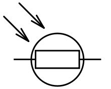

# Практическое занятие №4
# Разработка метеорологических устройств на базе микроконтроллерных модулей

## Цель работы

Целью практического занятия является получение практических навыков работы со средой моделирования и разработки микроконтроллерных модулей цифровых платформ экологического и метеорологического мониторинга.

## Теоретическая часть

__Метеорологические устройства для Arduino__

Помимо представленных на прошлом занятии датчиков температуры в симуляторе представлены модули, которые можно подключить к платформе Arduino и использовать в своих устройствах.

В библиотеке имеются образцы ультразвукового дальномера HC-SR04, датчика движения (PIR), датчика фоторезистора (LDR), датчика MPU6050 (акселерометр + гироскоп) и часы реального времени (DS1307), с которыми мы познакомимся далее.
Эти модули имеют косвенное отношение непосредственно к измерениям, поскольку не могут измерить экологические или метеорологические параметры. Но указанные модули могут быть использованы в качестве триггеров измерения (пример: если значение с модуля больше\меньше установленного порога, то опросить основной датчик), а также в качестве дополнительного оборудования для ведения журнала измерений (пример: модуль RTC, принцип его работы будет представлен далее по тексту)

__Ультразвуковой дальномер HC-SR04__

Ультразвуковой дальномер определяет расстояние до объектов по отраженному ультразвуковому сигналу: генерирует импульс на частоте 40 кГц и определяет время прихода эхо-сигнала (в обратном направлении). Принцип работы основан на расчете значения разницы времени отправки сигнала и времени приема отраженного сигнала от какой-либо поверхности. Распространённые модификации датчика позволяют производить измерения со следующими параметрами:

* Диапазон расстояний: 2-400 см
* Эффективный угол наблюдений: 15°
* Максимальный угол наблюдений: 25°
* Точность измерений: до 1 см

Применение этого датчика - триггер для сторонней функции опроса или обработки данных. Пример: проводить измерение при наличии подвижного объекта в зоне видимости датчика дальномера. При таком поведении потребуется периодически опрашивать датчик дальномера, и, при изменении его показаний, производить вызов необходимой функции опроса других датчиков.

<p align="center">
<br>
Рисунок 1 – Модуль дальномера HC-SR04
</p>


<p align="center">
<br>
Рисунок 2 – Схема подключения модуля
</p>

Датчик HC-SR04 имеет четыре вывода: выводы питания `Vcc` и `Gnd`, цифровой вход `Trig` и цифровой выход `Echo`. Цифровые входы и выводы можно подключать к любым пинам Arduino-платформ.
<p align="center">
<br>
Рисунок 3 – Схема измерительного стенда
</p>


__Датчик фоторезистора (LDR)__

Фоторезистор, как следует из названия, является производным от резистора - простейшего схемотехнического элемента, регулирующего сопротивление в электрической цепи. Обычный резистор имеет постоянное сопротивление, которое практически не меняется при изменениях во внешней среде. Это свойство не сохраняется у фоторезистора - светозависимого резистора. Таким образом, в простейшем применении фоторезистор позволяет опрашивать датчики в зависимости от времени суток (от отвещенности), или снижать яркость дисплея устройства в сумерках и ночью для снижения энергопотребления устройства.

<p align="center">
<br>
Рисунок 4 – Обозначение фоторезистора
</p>

Фоторезистор изменяет своё электрическое сопротивление в широком диапазоне в зависимости от освещенности его поверхности: от $10^7 Ом$ в полной темноте до $100\ Ом$ под прямыми солнечными лучами. 

Существуют готовые модули с обвязкой фоторезистора в виде резистивного делителя, где одно плечо электрической схемы - резистор, второе - фоторезистор, и компаратора, сравнивающего уровень освещённости (напряжение на резистивном делителе) с опорным, задаваемым потенциометром. Такие модули можно подключать как к аналоговым входам Arduino (`AOUT`), тогда микроконтроллер будет измерять напряжение на делителе напряжения, так и к цифровым входам Arduino (`DOUT`) - туда будет приходить напряжение с компаратора.

<p align="center">
<br>
Рисунок 5 – Внешний вид макета с модулем фоторезистора
</p>

__Часы реального времени (DS1307)__

Микроконтроллеры в платформах Arduino не имеют встроенных часов помимо счетчика микросекунд, прошедших с подачи питания. Этот счётчик не сохраняется после выключения и, более того, может переполниться и сброситься до нуля, если устройство работает непрерывно более месяца. Он бывает полезен для создания периодических событий с малой продолжительностью, например, управление индикацией устройства с частотой в несколько раз в секунду. Более подробно с этим таймером можно познакомиться через документацию к уже знакомым функциям `millis()` и `micros()` среды Arduino.

<p align="center">
<br>
Рисунок 6 – Пример модуля часов реального времени
</p>


Для метеорологических наблюдений требуется отслеживать и фиксировать время наступления событий, а не только факт их наступления, то есть фактически выполнять журналирование событий (время - измеряемый параметр - значение). Встроенный счетчик для этого очевидно мало применим. Для решения проблемы существуют внешние модули часов реального времени (Real Time Clock -RTC) - небольшая микросхема с батарейкой и часовым кварцевым резонатором. Встроенная батарейка позволяет поддерживать подсчет времени даже при отключении основного микроконтроллера, а часовой кварц имеет более стабильную частоту, нежели генератор частоты процессора Arduino. Соответственно и большую точность.

Для подключения модуля используется интерейс I2C и его контакты `SCL` и `SDA`.

Как можно убедиться, основу работы с Arduino составляет подключение и обмен информацией с подключаемыми модулями. Метеорологические и экологические платформы, в частности, оконечные устройства цифровых систем мониторинга зачастую имеют в своем составе ряд датчиков, температуры, влажности воздуха, скорости ветра, концентрации различных веществ и другие. Все эти датчики подключаются с использованием стандартных протоколов и технологий, которые будут рассмотрены в ходе практического занятия.
<p align="center">
<br>
Рисунок 7 – Внешний вид макета с модулем часов реального времени
</p>


## Практическая часть

Работа в виртуальной среде производится на сайте [https://wokwi.com](https://wokwi.com). Рекомендуется создание проекта с платформой Arduino, однако и другие платформы: STM32, RPi Pico, ESP32 - совместимы и могут применяться в метеорологических устройствах.

__Работа с датчиком HC-SR04__

<p align="center">
<br>
Рисунок 8 – Внешний вид макета с ультразвуковым дальномером
</p>

Содержание вкладки `diagram.json`:
```json
    {
      "version": 1,
      "author": "Anonymous maker",
      "editor": "wokwi",
      "parts": [
        { "type": "wokwi-arduino-uno", "id": "uno", "top": 0, "left": 0, "attrs": {} },
        {
          "type": "wokwi-hc-sr04",
          "id": "ultrasonic1",
          "top": -140.26,
          "left": 125.76,
          "attrs": { "distance": "400" }
        }
      ],
      "connections": [
        [ "ultrasonic1:ECHO", "uno:2", "green", [ "v24", "h12" ] ],
        [ "ultrasonic1:TRIG", "uno:3", "blue", [ "v29", "h21" ] ],
        [ "ultrasonic1:GND", "uno:GND.1", "black", [ "v17", "h-99" ] ],
        [ "ultrasonic1:VCC", "uno:5V", "red", [ "v12", "h-130", "v242", "h0" ] ]
      ]
    }
```

Содержание вкладки основной программы:

```cpp
/**
   HC-SR04 Distance Sensor Example
   https://wokwi.com/arduino/projects/304444938977804866
*/
#define PIN_TRIG 3  // Вход датчика, триггер начала измерений
#define PIN_ECHO 2  // Выход датчика, сигнал о возврате эхо-сигнала от импульса

void setup() {      //  Начальная настройка платы
  Serial.begin(115200); //Инициирует последовательное соединение и задает 
  //скорость передачи данных в бит/c (бод) для обмена информацией с ПК
  pinMode(PIN_TRIG, OUTPUT); // Настройка пинов Arduino (выход, вход)
  pinMode(PIN_ECHO, INPUT);
}

void loop() {
//--------------------------------------------------------------------
  // Начало нового измерения внутри основного цикла
  // Подача импульса длительностью 10 мкс на вход TRIG для начала измерений  
  digitalWrite(PIN_TRIG, HIGH);                     //
  delayMicroseconds(10);                            //
  digitalWrite(PIN_TRIG, LOW);                      //
//--------------------------------------------------------------------
  
//--------------------------------------------------------------------
  // Подсчёт результата опроса дальномера
  int duration = pulseIn(PIN_ECHO, HIGH); 
  // Встроенная функция
  // среды Arduino для определения длины импульса
//--------------------------------------------------------------------

//--------------------------------------------------------------------
  Serial.print("Distance in CM: ");
  Serial.println(duration / 58); 
  // вывод результата,
  // который вычисляется из длины импульса с модуля
  // и преобразуется к длине до ближайшего объекта 
//--------------------------------------------------------------------

  delay(1000); // задержка до следующего замера
}
```

__Работа с модулем фоторезистора__

<p align="center">
<br>
Рисунок 9 – Внешний вид макета с фоторезистором
</p>

Содержание вкладки `diagram.json`:

```json
{
  "version": 1,
  "author": "Anonymous maker",
  "editor": "wokwi",
  "parts": [
    {
      "type": "wokwi-arduino-uno",
      "id": "uno",
      "top": 3.6,
      "left": 113.6,
      "rotate": 90,
      "attrs": {}
    },
    {
      "type": "wokwi-photoresistor-sensor",
      "id": "ldr3",
      "top": 233.6,
      "left": -76,
      "attrs": { "lux": "1000", "threshold": "3.0", "rl10": "20", "gamma": "1.2" }
    }
  ],
  "connections": [
    [ "uno:5V", "ldr3:VCC", "red", [ "h-38.3", "v119" ] ],
    [ "uno:GND.2", "ldr3:GND", "black", [ "h-28.7", "v119.5" ] ],
    [ "ldr3:DO", "uno:4", "green", [ "h316.8", "v-81.3" ] ],
    [ "ldr3:AO", "uno:A0", "magenta", [ "h48", "v-81.5" ] ]
  ],
  "dependencies": {}
}
```

Содержание вкладки основной программы:

```cpp
// Docs: https://docs.wokwi.com/parts/wokwi-photoresistor-sensor

const float GAMMA = 1.2; // стандартные характеристики фоторезистора (взяты из документации к датчику),
const float RL10 = 20.0; // по которым можно восстановить его зависимость сопротивления от освещённости

void setup() 
{
  Serial.begin(115200); // подключение последовательного порта
}

void loop() 
{
  int analogValue = analogRead(A0);
  // измерение напряжения на резистивном делителе (аналоговый выход датчика)

  float voltage = float(analogValue) / 1024.0 * 5.0;
  // преобразование к напряжению на делителе

  float resistance = 2000.0 * voltage / (1.0 - voltage / 5.0);
  // вычисление сопротивления фоторезистора через закон Ома

  float lux = pow(RL10 * 1e3 * pow(10.0, GAMMA) / resistance, (1.0 / GAMMA));
  // вычисление освещённости в Люкс

  if(isfinite(lux)) //проверка, что число не стремится к бесконечности
  {
    //Если верно, вывод освещенности в терминал
    Serial.print("The brightness is ");
    Serial.print(lux);
    Serial.println(" lx");
    //
  }
  else
  {
    //Если значение стремится к бесконечности
    //вывод сообщения о слишком высокой освещенности (слишком яркий свет для измерений)
    Serial.println("Too bright to measure");
  }

  delay(750); //Производить опрос раз в 0.75 секунд
}
```

__Работа с часами реального времени__

<p align="center">
<br>
Рисунок 10 – Внешний вид макета с модулем часов реального времени
</p>

Содержание вкладки `libraries.txt`:
```Md
# Wokwi Library List
# See https://docs.wokwi.com/guides/libraries

# Automatically added based on includes:
RTClib
# ---
```

Содержание вкладки diagram.json:

```json
{
  "version": 1,
  "author": "Uri Shaked",
  "editor": "wokwi",
  "parts": [
    {
      "id": "uno",
      "type": "wokwi-arduino-uno",
      "top": 0,
      "left": 20
    },
    {
      "id": "ds1307",
      "type": "wokwi-ds1307",
      "top": 250,
      "left": 220
    }
  ],
  "connections": [
    ["uno:GND.2", "ds1307:GND", "black", ["v20", "*", "v0"]],
    ["uno:5V", "ds1307:5V", "red", ["v0"]],
    ["uno:A4", "ds1307:SDA", "green", ["v16", "h0", "*", "h-34"]],
    ["uno:A5", "ds1307:SCL", "orange", ["v20", "*", "h-30"]]
  ]
}
```

Содержание вкладки основной программы:

```cpp
#include "RTClib.h" // подключение библиотеки RTC

RTC_DS1307 rtc; // объект взаимодействия с часами реального времени (взят из документации к библиотеке RTC)

char daysOfTheWeek[7][12] = {"Sunday", "Monday", "Tuesday", "Wednesday", "Thursday", "Friday", "Saturday"};
// массив строк с названиями дней недели

void setup () {
  Serial.begin(115200);
  // подключение последовательного порта

//--------------------------------------------------------------------
//Проверка подчключения модуля часов реального времени
  if (! rtc.begin()) {
    Serial.println("Couldn't find RTC");
    Serial.flush();
    abort();
  }
//--------------------------------------------------------------------
}

void loop () {
  DateTime now = rtc.now();
  // объект типа DateTime (дата) с значением времени, запрошенным с модуля часов реального времени
  // в этом примере используется функция из библиотеки, rtc.now() выводит текущее значение времени, известное модулю RTC

  // Ниже приведены методы работы с библиотечным классом DateTime: 
  Serial.print("Current time: ");
  Serial.print(now.year(), DEC);  // текущий год
  Serial.print('/');
  Serial.print(now.month(), DEC); // текущий месяц 
  Serial.print('/');
  Serial.print(now.day(), DEC);   // текущий день
  Serial.print(" (");
  Serial.print(daysOfTheWeek[now.dayOfTheWeek()]); //номер дня недели 
  Serial.print(") ");
  Serial.print(now.hour(), DEC);   // вывод часа
  Serial.print(':');
  Serial.print(now.minute(), DEC); // вывод минут
  Serial.print(':');
  Serial.print(now.second(), DEC); // вывод секунд
  Serial.println();

  Serial.println();
  delay(3000);
}
```
В примере принято, что модуль RTC уже сконфигурирован. Но этот модуль не может знать точное время при первом использовании, поскольку работает только с подключенным аккумулятором или батарейкой. Таким образом, при первом использовании его необходимо явно сконфигурировать, для этого используют отдельный скетч (программу), в которой указывают `rtc.adjust(DateTime(2020, 8, 19, 12, 0, 0));  // 19 августа 2020 года 12:00:00`,  эта строка установит время на модуле - точку начального отсчета. Также можно взять время с компьютера при прошивке программы в микроконтроллер, такой подход реализуется добавлением `rtc.adjust(DateTime(F(__DATE__), F(__TIME__)));` в программу

## Варианты выполнения заданий

Вариант выполнения задания определяется остатком от деления номера студента внутри группы на 3.

| Вариант | 0 | 1 | 2 |
|---------|---|---|---|
| Датчик  | HC-SR04| LDR | RTC |

1. Создайте проект с одним из датчиков по вариантам. Опишите поведение программы в зависимости от входных данных: освещённости, времени, расстояния до объекта. Объясните, какие преобразования данных осуществляются в программе (при их наличии), а какие данные или физические характеристики хранятся в подключаемом модуле.
2. Опишите возможности применения указанных модулей в каком-либо кейсе мониторинга экологических и/или метеорологических параметров.

## Список рекомендуемой литературы
1.	https://wokwi.com
2.	https://docs.wokwi.com/parts/wokwi-arduino-uno
3.	http://wiki.amperka.ru/продукты:hc-sr04-ultrasonic-sensor-distance-module
4. http://wiki.amperka.ru/продукты:troyka-rtc
