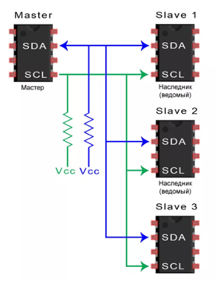
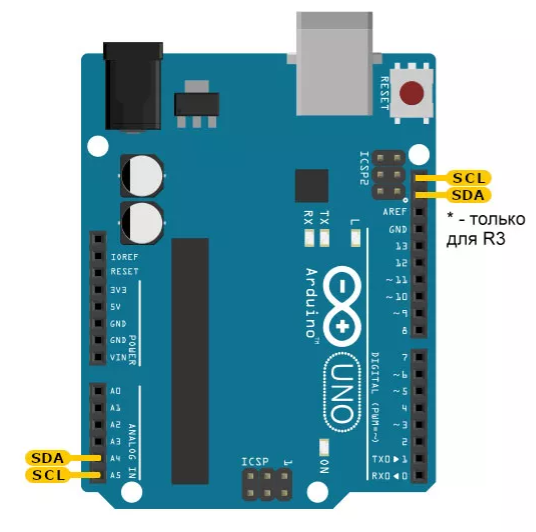
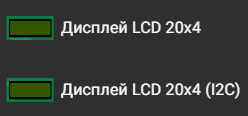
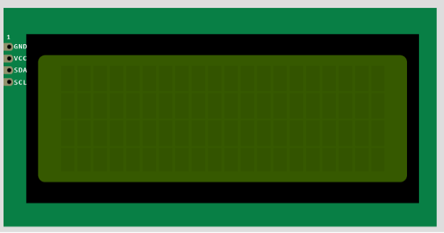
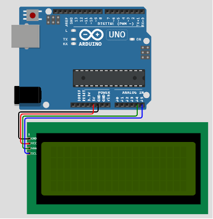
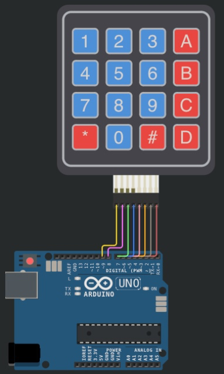
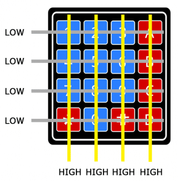
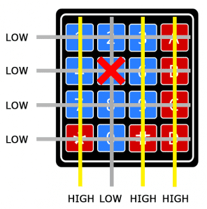
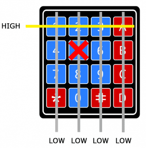

# Практическое занятие №4
# Ввод и вывод данных. Работа со встраиваемыми модулями МК, устройства взаимодействия с пользователем. 
## Цель работы
Целью практического занятия является получение практических навыков работы со средой моделирования и разработки микроконтроллерных модулей цифровых платформ.

## Теоретическая часть
### Модули вывода
В данной работе для вывода информации пользователю используются LCD дисплеи c интерфейсом I²C.
### I²C
I²C - двухпроводная шина связи электронных устройств. Состоит из линии тактирующего сигнала SCL (сокращение от _Serial Clock_) и SDA (_Serial Data_). Устройства, соединённые шиной I²C, используют иерархию Ведущий-Ведомые. Шина I²C позволяет подключить сразу несколько ведомых устройств к микроконтроллеру, задействуя всего два пина: дисплеи, датчики, контроллеры питания.

**Ведущее устройство** управляет общением всех устройств на шине, сканирует доступные устройства и опрашивает их по необходимости. Без разрешения ведущего устройства ведомые не могут использовать шину I²C.

**Ведомые устройства** исполняют команды ведущего устройства, отвечают в установленные интервалы в соответствие с тактированием. 

Тактирующие сигналы SCL позволяют синхронизировать работу ведущего и ведомых устройств, чтобы переключения логических уровней происходили одновременно. Сигнальная шина SDA по умолчанию установлена в 1 (используется подтягивающий резистор к питанию). Для "общения" устройства замыкают сигнальную шину на змелю, тем самым переключая логическую 1 в 0. Именно поэтому общение сразу двух ведомых устройств одновременно невозможно - их сигналы смешаются.

#### Передача информации:
Служебные команды (Start, Stop) производятся путем изменения линии SDA при высоком уровне линии тактов (SCL). Данные же передаются установкой линии SDA при низком уровне линии SCL
* Начало передачи начинается с установки состояния Start(высокий уровень SCL, провал уровня SDA). Передача заканчивается с установлением состояния Stop(высокий уровень SCL, установление высокого уровня SDA)
* Передача данных Ведущее(Master)->Ведомое(Slave): Ведущий генерирует тактирующий сигнал на SCL и передает бит по SDA. Как только уровень SCL становится высоким  - ведомый считывает данные. Ведомый имеет 
* Передача данных Ведомое(Slave)->Ведущее(Master): Ведущий генерирует тактирующий сигнал на SCL. При SCL == 0 ведомое устройство устанавливает необходимый бит на SDA. При SCL == 1 ведущее устройства считывает данные с SDA.

#### Преимущества:
* На одной двупроводной линии может находиться до 127 устройств.
* За счет наличия ведущего устройства и тактирующих сигналов протокол передачи данных не зависит от времени.
* Может быть несколько ведущих устройств
* Простая расширяемость
#### Недостатки:
* Низкая тактовая частота
* Возможные коллизии при неправильно спроектированной программе и наличии нескольких ведущих устройствах

<p align="center">
<br>
Рисунок 1 – Схема работы I2C протокола
</p>

## Важно!
Порты ввода-вывода Arduino используют напряжение 5 В. Логические уровни у множества подключаемых ведомых устройств равны 3.3 В. В таком случае необходимо либо устанавливать преобразователь TTL уровней, либо использовать устройства с `5V tolerant` пинами. Многие микросхемы, не смотря на питание от 3,3 В, могут использовать 5 В на сигнальных линиях.

### I²C Arduino

Arduino имеет специальные контакты для I²C, на которые установлены подтягивающие резисторы в соответствии с требованиями протокола I²C.

Для плат Arduino Uno это контакты A4 и A5. 

_Пин A4_ соответсвует линии SDA.
_Пин A5_ соответсвует линии SCL. 

В версии Arduino Uno R3 есть еще один набор контактов I2C рядом с USB-разъемом:

<p align="center">
<br>
Рисунок 2 – Пины i2c на Arduino
</p>

### Дисплей LCD 20x4
Данный дисплей представляет собой экран с 4 рядами по 20 символов

<p align="center">

<br>
Рисунок 3 – Дисплей LCD20x4
</p>

На дисплей могут быть выведены как стандартные символы, так и рисунки.

### Базовый вывод на дисплей
Создадим проект со следуюещй схемой подключения:

<p align="center">
<br>
Рисунок 4 – Схема подключения дисплея
</p>

Код основной программы:
```cpp
#include <LiquidCrystal_I2C.h>

// Параметры подключаемого дисплея
#define I2C_ADDR    0x27  ///< Адрес устройства(дисплей) 
#define LCD_COLUMNS 20    ///< Количество столбцов в дисплее
#define LCD_LINES   4     ///< Количетсво строк в дисплее

//Создадим объект класса, описывающего дисплей
LiquidCrystal_I2C lcd(I2C_ADDR, LCD_COLUMNS, LCD_LINES); 

void setup() 
{
  lcd.init();       // Инициализация дисплея
  lcd.backlight();  // Включаем подсветку

  // Устанавливаем курсор и выводим текст на дисплей
  // setCursor(column index, line index)
  lcd.setCursor(4, 0);
  lcd.print("Hello, world!");
  lcd.setCursor(2, 3);
  lcd.print("Enjoy!");
}

void loop() 
{
  uint8_t i;    // переменная-счетчик для цикла
  lcd.clear();  // Очищаем дисплей от предыдущего вывода
  for (i = 0; i < LCD_COLUMNS; i++)
  {// Нарисуем полосы во всю длину дисплея
  lcd.setCursor(i,0);
  lcd.print("=");
  lcd.setCursor(i,2);
  lcd.print("=");
  }
  lcd.setCursor(9,1);
  lcd.print(millis()/1000); // Вывод счетчика времени
  delay(1000);              // Дисплей обновляется раз в 1000мс
}
```

Код листа описания diagram.json:
```json
{
  "version": 1,
  "author": "Uri Shaked",
  "editor": "wokwi",
  "parts": [
    { "type": "wokwi-arduino-uno", "id": "uno", "top": 20, "left": 20, "attrs": {} },
    { "type": "wokwi-lcd2004", "id": "lcd", "top": 246, "left": 50, "attrs": { "pins": "i2c" } }
  ],
  "connections": [
    [ "uno:GND.2", "lcd:GND", "black", [ "v14", "*", "h-20" ] ],
    [ "uno:5V", "lcd:VCC", "red", [ "v18", "*", "h-16" ] ],
    [ "uno:A4", "lcd:SDA", "green", [ "v22", "*", "h-12" ] ],
    [ "uno:A5", "lcd:SCL", "blue", [ "v26", "*", "h-8" ] ]
  ],
  "dependencies": {}
}
```

Код листа использованных библиотек libraries.txt
```
# Wokwi Library List
# See https://docs.wokwi.com/guides/libraries

# Automatically added based on includes:
LiquidCrystal I2C
```

## Модули ввода
В данной работе модулем ввода будет служить циферная клавиатура (Keypad)

Cхема представлена ниже:

<p align="center">
<br>
Рисунок 5 – Схема проекта
</p>

### Основная логика работы модуля KeyPad:

1. Когда кнопки не нажаты, все контакты столбцов удерживаются на высоком уровне, а все контакты строк удерживаются на низком уровне:

<p align="center">
<br>
Рисунок 6 – Состояния с отжатыми кнопками
</p>

2. При нажатии кнопки уровень вывода столбца, на котором находится кнопка, становится "0".

<p align="center">
<br>
Рисунок 7 – Произошло нажатие кнопки
</p>

3. Arduino теперь знает, в каком столбце находится кнопка. Теперь нужно найти строку. Для этого происходит переключениие каждого из выводов строк на высокий уровень "1", при этом происходит чтение вывода найденного на шаге 2 столбца. Если вывод столбца вновь станет высоким "1", то соответсвующая кнопке строка в процессе перебора была установлена в "1". Следовательно строка найдена.
<div align="center">

<br>
</div>
<p align="center">
Рисунок 8 – Перебор строк
</p>


```cpp
#include <Keypad.h>

static const uint8_t ROWS = 4;
static const uint8_t COLS = 4;
static char keys[ROWS][COLS] = {  ///< Матрица символов KeyPad'a
  { '1', '2', '3', 'A' },
  { '4', '5', '6', 'B' },
  { '7', '8', '9', 'C' },
  { '*', '0', '#', 'D' }
};


static uint8_t colPins[COLS] = { 5, 4, 3, 2 }; //< Arduino pin's соотвествующие выводам столбцов KeyPad'a
static uint8_t rowPins[ROWS] = { 9, 8, 7, 6 }; ///< Arduino pin's соотвествующие выводам строк KeyPad'a
/* 
Соответствие подключенных пинов Arduino и Keypad
| Keypad pin | Arduino Pin |
|------------|-------------|
| R0         | 2           |
| R1         | 3           |
| R2         | 4           |
| R3         | 5           |
| C0         | 6           |
| C1         | 7           |
| C2         | 8           |
| C3         | 9           |
*/

Keypad keypad = Keypad(makeKeymap(keys), rowPins, colPins, ROWS, COLS); //Объекта класса, описывающего keypad
 
void setup() 
{
  Serial.begin(9600); // Открытие последовательного порта на скорости 9600 бод
}

void loop() 
{
  char key = keypad.getKey(); //Опрос состояния клавиатуры

  if (key != NO_KEY)
  { // Если какая-либо клавиша была нажата
    Serial.println(key); // Вывод нажатой клавиши в последовательный порт
  }
}
```


Код листа описания diagram.json:
```json
{
  "version": 1,
  "author": "Uri Shaked",
  "editor": "wokwi",
  "parts": [
    { "type": "wokwi-arduino-uno", "id": "uno", "top": 402.94, "left": 25, "attrs": {} },
    {
      "type": "wokwi-membrane-keypad",
      "id": "keypad",
      "top": -11.91,
      "left": 112.06,
      "attrs": {}
    }
  ],
  "connections": [
    [ "uno:2", "keypad:C4", "brown", [] ],
    [ "uno:3", "keypad:C3", "gray", [] ],
    [ "uno:4", "keypad:C2", "orange", [] ],
    [ "uno:5", "keypad:C1", "pink", [] ],
    [ "uno:6", "keypad:R4", "blue", [] ],
    [ "uno:7", "keypad:R3", "green", [] ],
    [ "uno:8", "keypad:R2", "purple", [ "v-14", "h0" ] ],
    [ "uno:9", "keypad:R1", "gold", [ "v-18", "h0" ] ]
  ],
  "dependencies": {}
}
```
Код листа использованных библиотек libraries.txt
```
# Wokwi Library List
# See https://docs.wokwi.com/guides/libraries

# Automatically added based on includes:
Keypad
```

## Список рекомендуемой литературы
1.	https://wokwi.com
2.	https://docs.wokwi.com/parts/wokwi-arduino-uno
3.  https://docs.wokwi.com/parts/wokwi-lcd2004
4.  https://docs.wokwi.com/parts/wokwi-membrane-keypad
