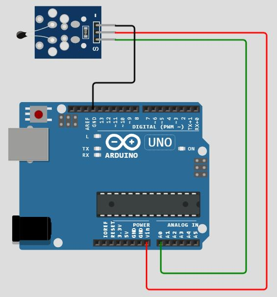
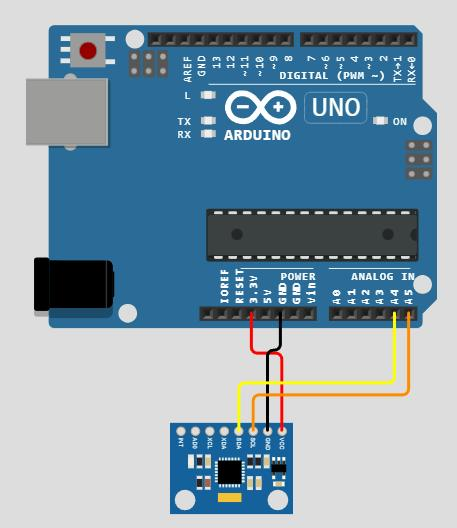
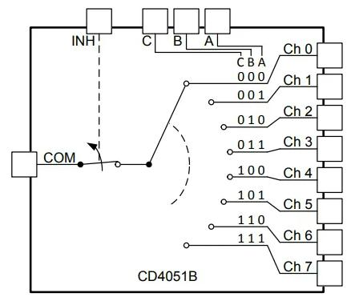
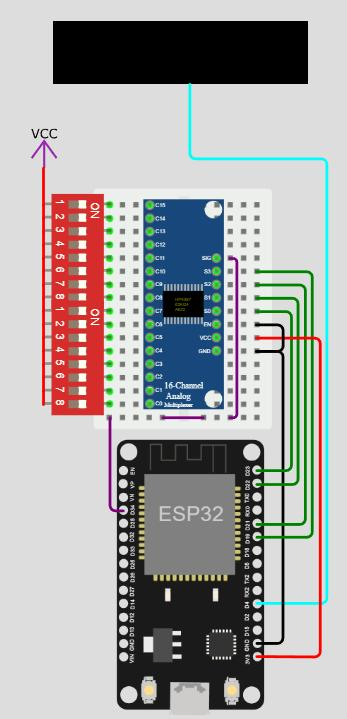

# Практическое занятие №6
# Аналоговые и цифровые сенсоры. Мультиплексирование сенсоров. 

## Цель работы

Целью практического занятия является получение практических навыков
работы со средой моделирования и разработки микроконтроллерных
модулей цифровых платформ.

## Теоретическая часть
### Аналоговые и цифровые сенсоры

В процессе занятия будет использоваться аналоговое устройство
детектирования – температурный датчик ntc, аналоговый, его
уже рассматривали в ПЗ2.



Рисунок 1 – Температурный датчик ntc, подключённый к Arduino Uno

Содержание вкладки libraries.txt:

Содержание вкладки diagram.json:

```json{
{
  "version": 1,
  "author": "Anonymous maker",
  "editor": "wokwi",
  "parts": [
    {
      "type": "wokwi-arduino-uno",
      "id": "uno",
      "top": 0,
      "left": 0,
      "attrs": {}
    },
    {
      "type": "wokwi-ntc-temperature-sensor",
      "id": "ntc1",
      "top": -130.63,
      "left": 11.15,
      "attrs": {
        "beta": "3950",
        "temperature": "33"
      }
    }
  ],
  "connections": [
    [ "ntc1:OUT", "uno:A0", "green", [ "h178", "v319", "h-81" ] ],
    [ "ntc1:VCC", "uno:VIN", "red", [ "h206", "v351", "h-137" ] ],
    [ "ntc1:GND", "uno:GND.1", "black", [ "h26", "v78", "h-58" ] ]
  ]
}

```

Содержание вкладки основной программы с комментариями:

```cpp
/**
  Basic NTC Thermistor demo
  https://wokwi.com/arduino/projects/299330254810382858
  Assumes a 10K@25℃ NTC thermistor connected in series with a 10K resistor.
  Copyright (C) 2021, Uri Shaked
*/

const float BETA = 3950; // задается в зависимости от тех. документации к термистору

void setup() {
  Serial.begin(9600);
}

void loop() {
  int analogValue = analogRead(A0);
  float celsius = 1 / (log(1 / (1023. / analogValue - 1)) / BETA + 1.0 / 298.15) - 273.15; //формула перевода в градусы Цельсия
  Serial.print("Temperature: ");
  Serial.print(celsius); //Вывод результата на экран
  Serial.println(" ℃");
  delay(1000); //проводить измерения раз в секунду
```

В противовес аналоговому устройству ввода-вывода, рассмотрим цифровое –
гироскоп MPU6050 (акселерометр + гироскоп). Данное устройство
использует интерфейс I2C.



Рисунок 2 – Гироскоп, подключённый к Arduino Uno

Содержание вкладки libraries.txt:
```
Adafruit MPU6050
```

Содержание вкладки diagram.json:
```json
{
  "version": 1,
  "author": "Uri Shaked",
  "editor": "wokwi",
  "parts": [
    { "type": "wokwi-arduino-uno", "id": "uno", "top": 0, "left": 0, "attrs": {} },
    { "type": "wokwi-mpu6050", "id": "mpu1", "top": 264.52, "left": 96.05, "attrs": {} }
  ],
  "connections": [
    [ "uno:3.3V", "mpu1:VCC", "red", [ "v27", "h29" ] ],
    [ "uno:GND.2", "mpu1:GND", "black", [ "v25", "h66" ] ],
    [ "uno:A5", "mpu1:SCL", "darkorange", [ "v55", "h-105" ] ],
    [ "uno:A4", "mpu1:SDA", "yellow", [ "v47", "h-95" ] ]
  ]
}

```

Содержание вкладки основной программы с комментариями:

```cpp
// MPU6050 example
// https://wokwi.com/arduino/projects/305937248748044864

#include <Adafruit_MPU6050.h> //подключение библиотек, нужных для взаимодействия с устройством
#include <Adafruit_Sensor.h>
#include <Wire.h>
Adafruit_MPU6050 mpu;

void setup(void) {
  Serial.begin(115200);  //Инициализация последовательного соединения и задача скорости передачи данных

  while (!mpu.begin()) {  // проверка на соединение
    Serial.println("MPU6050 not connected!");
    delay(1000);
  }
  Serial.println("MPU6050 ready!");
}

sensors_event_t event;  //Создание объекта из библиотеки, описыввающей работу устройства

void loop() {  //Опрос устройства и получение результатов
  mpu.getAccelerometerSensor()->getEvent(&event);

  Serial.print("[");
  Serial.print(millis());
  Serial.print("] X: ");
  Serial.print(event.acceleration.x);
  Serial.print(", Y: ");
  Serial.print(event.acceleration.y);
  Serial.print(", Z: ");
  Serial.print(event.acceleration.z);
  Serial.println(" m/s^2");
  delay(500);
}
```

### Мультиплексирование сенсоров

`Мультиплексор` - устройство имеющее много сигнальных входов и мало (либо
вообще один) сигнальных выходов, поочередно соединяемых между собой.
Порядок соединения определяется комбинацией других сигнальных входов
устройства, так называемого селектора. Мультиплексор в народе также
известен под названием ключ или коммутатор.



Рисунок 3 – Внутренняя принципиальная схема мультиплексора в общем
случае

Применений такому устройству можно придумать массу, входящих сигналов
обычно всегда больше, чем рахъемов у контроллера, а уделить внимание надо
всем. Особенно ценен, в этом смысле, мультиплексор аналоговый, то есть
передающий не только логический уровень сигнала, но и его напряжение,
потому что разъемов с аналого-цифрового преобразователя на контроллере еще меньше. А еще очень удобен для
“механического” преобразования параллельного сигнала в последовательный,
достаточно лишь сегментировать сигналы с входов на определенные временные
диапазоны.

Мультиплексоры могут быть цифровыми и аналоговыми. Первые могут
копировать сигнал, не передавая его напрямую, а значит
обеспечивать гальваническую развязку и, при необходимости,
преобразовывать уровни, например, с 5V на 3.3V, что не только
экономит свободные разъемы, но и упрощает схему подключения, а также делает ее
безопасной. Кроме того, мультиплексоры отличаются количеством входов,
выходов и взаимосвязью между ними. Задачи бывают разные, и
мультиплексоры под них тоже. Наиболее популярный,
“классический” имеет несколько (кратно степени двойки)
входов, чаще 4, 8 или 16 и один выход.

Рассмотрим пример с мультиплексором CD74HC4067 – 16-ти канальный
мультиплексор, аналоговый.



Рисунок 4 – Подключение дисплея, мультиплексора и панели переключателей
к arduino

Содержание вкладки libraries.txt:
```
\# Wokwi Library List
\# See https://docs.wokwi.com/guides/libraries
\# Automatically added based on includes:
Adafruit NeoPixel
```
Содержание вкладки diagram.json:
```json
{
  "version": 1,
  "author": "Maverick",
  "editor": "wokwi",
  "parts": [
    {
      "type": "wokwi-breadboard-mini",
      "id": "bb1",
      "top": 173.7,
      "left": 51.5,
      "rotate": 90,
      "attrs": {}
    },
    { "type": "wokwi-esp32-devkit-v1", "id": "esp", "top": 331.1, "left": 91, "attrs": {} },
    {
      "type": "wokwi-neopixel-canvas",
      "id": "neopixels",
      "top": 29.57,
      "left": 44.55,
      "attrs": { "rows": "2", "cols": "8", "pixelate": "circle" }
    },
    { "type": "board-cd74hc4067", "id": "mux1", "top": 158.85, "left": 110.29, "attrs": {} },
    { "type": "wokwi-vcc", "id": "vcc1", "top": 108.31, "left": 28.78, "attrs": {} },
    {
      "type": "wokwi-dip-switch-8",
      "id": "sw1",
      "top": 169.1,
      "left": 20.7,
      "rotate": 90,
      "attrs": {}
    },
    {
      "type": "wokwi-dip-switch-8",
      "id": "sw2",
      "top": 245.9,
      "left": 20.7,
      "rotate": 90,
      "attrs": {}
    }
  ],
  "connections": [
    [ "esp:D4", "neopixels:DIN", "cyan", [ "h50.65", "v-321.64", "h-98.9" ] ],
    [ "esp:GND.1", "bb1:12t.a", "black", [ "h18.91", "v-211.71" ] ],
    [ "esp:D23", "bb1:9t.a", "green", [ "h25.01", "v-83.03" ] ],
    [ "esp:D22", "bb1:8t.a", "green", [ "h29.78", "v-134.7" ] ],
    [ "esp:D21", "bb1:7t.a", "green", [ "h35.09", "v-39.21" ] ],
    [ "esp:D19", "bb1:6t.a", "green", [ "h40.05", "v-192.1" ] ],
    [ "esp:D34", "bb1:17b.j", "purple", [ "h0" ] ],
    [ "bb1:17b.f", "bb1:17t.e", "purple", [ "h0" ] ],
    [ "bb1:17t.c", "bb1:5t.c", "purple", [ "h5.11", "v-115.2" ] ],
    [ "esp:3V3", "bb1:11t.a", "red", [ "v0.3", "h45.82", "v-230.7" ] ],
    [ "bb1:10t.a", "bb1:12t.a", "black", [ "h19.28", "v20.58" ] ],
    [ "vcc1:VCC", "sw1:1a", "red", [ "v0" ] ],
    [ "sw1:1a", "sw1:2a", "red", [ "h0" ] ],
    [ "sw1:2a", "sw1:3a", "red", [ "h0" ] ],
    [ "sw1:3a", "sw1:4a", "red", [ "h0" ] ],
    [ "sw1:4a", "sw1:5a", "red", [ "h0" ] ],
    [ "sw1:5a", "sw1:6a", "red", [ "h0" ] ],
    [ "sw1:6a", "sw1:7a", "red", [ "h0" ] ],
    [ "sw1:7a", "sw1:8a", "red", [ "h0" ] ],
    [ "sw1:8a", "sw2:1a", "red", [ "h0" ] ],
    [ "sw2:1a", "sw2:2a", "red", [ "h0" ] ],
    [ "sw2:2a", "sw2:3a", "red", [ "h0" ] ],
    [ "sw2:3a", "sw2:4a", "red", [ "h0" ] ],
    [ "sw2:4a", "sw2:5a", "red", [ "h0" ] ],
    [ "sw2:5a", "sw2:6a", "red", [ "h0" ] ],
    [ "sw2:6a", "sw2:7a", "red", [ "h0" ] ],
    [ "sw2:7a", "sw2:8a", "red", [ "h0" ] ],
    [ "sw1:8b", "bb1:8b.j", "", [ "$bb" ] ],
    [ "sw1:7b", "bb1:7b.j", "", [ "$bb" ] ],
    [ "sw1:6b", "bb1:6b.j", "", [ "$bb" ] ],
    [ "sw1:5b", "bb1:5b.j", "", [ "$bb" ] ],
    [ "sw1:4b", "bb1:4b.j", "", [ "$bb" ] ],
    [ "sw1:3b", "bb1:3b.j", "", [ "$bb" ] ],
    [ "sw1:2b", "bb1:2b.j", "", [ "$bb" ] ],
    [ "sw1:1b", "bb1:1b.j", "", [ "$bb" ] ],
    [ "sw2:8b", "bb1:16b.j", "", [ "$bb" ] ],
    [ "sw2:7b", "bb1:15b.j", "", [ "$bb" ] ],
    [ "sw2:6b", "bb1:14b.j", "", [ "$bb" ] ],
    [ "sw2:5b", "bb1:13b.j", "", [ "$bb" ] ],
    [ "sw2:4b", "bb1:12b.j", "", [ "$bb" ] ],
    [ "sw2:3b", "bb1:11b.j", "", [ "$bb" ] ],
    [ "sw2:2b", "bb1:10b.j", "", [ "$bb" ] ],
    [ "sw2:1b", "bb1:9b.j", "", [ "$bb" ] ],
    [ "mux1:I15", "bb1:1b.g", "", [ "$bb" ] ],
    [ "mux1:I14", "bb1:2b.g", "", [ "$bb" ] ],
    [ "mux1:I13", "bb1:3b.g", "", [ "$bb" ] ],
    [ "mux1:I12", "bb1:4b.g", "", [ "$bb" ] ],
    [ "mux1:I11", "bb1:5b.g", "", [ "$bb" ] ],
    [ "mux1:I10", "bb1:6b.g", "", [ "$bb" ] ],
    [ "mux1:I9", "bb1:7b.g", "", [ "$bb" ] ],
    [ "mux1:I8", "bb1:8b.g", "", [ "$bb" ] ],
    [ "mux1:I7", "bb1:9b.g", "", [ "$bb" ] ],
    [ "mux1:I6", "bb1:10b.g", "", [ "$bb" ] ],
    [ "mux1:I5", "bb1:11b.g", "", [ "$bb" ] ],
    [ "mux1:I4", "bb1:12b.g", "", [ "$bb" ] ],
    [ "mux1:I3", "bb1:13b.g", "", [ "$bb" ] ],
    [ "mux1:I2", "bb1:14b.g", "", [ "$bb" ] ],
    [ "mux1:I1", "bb1:15b.g", "", [ "$bb" ] ],
    [ "mux1:I0", "bb1:16b.g", "", [ "$bb" ] ],
    [ "mux1:COM", "bb1:5t.d", "", [ "$bb" ] ],
    [ "mux1:S3", "bb1:6t.d", "", [ "$bb" ] ],
    [ "mux1:S2", "bb1:7t.d", "", [ "$bb" ] ],
    [ "mux1:S1", "bb1:8t.d", "", [ "$bb" ] ],
    [ "mux1:S0", "bb1:9t.d", "", [ "$bb" ] ],
    [ "mux1:EN", "bb1:10t.d", "", [ "$bb" ] ],
    [ "mux1:VCC", "bb1:11t.d", "", [ "$bb" ] ],
    [ "mux1:GND", "bb1:12t.d", "", [ "$bb" ] ]
  ],
  "dependencies": {}
}

```

Содержание вкладки основной программы с комментариями:

```c++
// CD74HC4067
// 16-Channel Analog Multiplexer
// https://www.ti.com/lit/ds/symlink/cd74hc4067.pdf

#include <Adafruit_NeoPixel.h>  //библиотека дисплея
#define COM 34 
#define NP_PIN 4
#define NUMPIXELS 16

Adafruit_NeoPixel pixels = Adafruit_NeoPixel(NUMPIXELS, NP_PIN, NEO_GRB + NEO_KHZ800);//Создания объекта для дисплея

const uint8_t controlPins[] = { 23, 22, 21, 19 }; //привязка пинов на arduino к пинам на мультиплексоре

float readMux(int channel)  //Считывание информации с 4 каналов мультиплексора
{
  for(int i = 0; i < 4; i ++)
  {
    digitalWrite(controlPins[i], channel >> i & 1);
  }
  delay(10);
  return analogRead(COM);
}

void setup()  // Предустановка пинов на запись
{
  for (int i = 0; i < 4; ++i)
  {
    pinMode(controlPins[i], OUTPUT);
  }
  pixels.begin();
}

void loop()  //считывание информации с мультиплексора и вывод на диспей
{
  pixels.clear();
  for(int i = 0; i < 16; ++i)
  {
    if (readMux(i) > 1500)
    {
      pixels.setPixelColor(i, pixels.Color(0, 150, 0));
    }
  }
  pixels.show();
}
```

Мультиплексор - простой и удобный инструмент для расширения возможностей
контроллера путем увеличения количества его пинов. Он понятнее в работе
чем входящий [сдвиговый регистр](https://go-radio.ru/registr.html), и, самое главное, имеет возможность
передавать аналоговый сигнал, недоступный другим решениям. Знать об
этом устройстве и уметь применять его на практике необходимо, потому
что это позволяет одним контроллером вести расчёты на основе целой
группы датчиков, например, средняя температура по нескольким
участкам, на каждом из которых есть свой одинаковый термометр.

## Варианты выполнения задания

Вариант выполнения задания определяется остатком от деления номера
студента внутри списка группы на 3.

| Вариант | 0     | 1       | 2   |
| ------- | ----- | ------- | --- |
| Датчик  | DHT22 | DS18B20 | NTC |

## Практическая часть 

Используя полученную информацию, создайте проект, в котором с помощью
мультиплексора считывается информация с группы одинаковых датчиков
температуры по вариантам и выводится средняя температура.

## Требования к оформлению отчета 

Отчет оформляется в виде файла в формате Microsoft Word. Скриншоты
добавляются в файл отчета с необходимыми пояснениями.

Требования к оформлению отчета в формате Microsoft Word:

- пользуйтесь
[правилами](https://orioks.miet.ru/storage/d/586467/36db82f65996d798b56fdb1bf01e328f1c204c86/%D0%9C%D0%A3%D0%A1_%D0%9E%D1%82%D1%87%D1%91%D1%82%20%D0%BF%D0%BE%20%D0%BB%D0%B0%D0%B1%D0%BE%D1%80%D0%B0%D1%82%D0%BE%D1%80%D0%BD%D1%8B%D0%BC%20%D1%80%D0%B0%D0%B1%D0%BE%D1%82%D0)
оформления лабораторных работ;

- при написании кода используйте стили программирования (делайте код
удобным для прочтения).

Требования к наименованию файлов отчета:

- файл отчета именуется «ЛабХХФамилияИООтчет.doc», где ХХ – двухзначный
номер лабораторной работы, например, 02; ФамилияИО – фамилия и инициалы
студента, например, ИвановИИ. Пример наименования файла отчета для
третьей лабораторной работы выполненной Ивановым И.И. –
«Лаб03ИвановИИ.doc»;

- дополнительные файлы именуются аналогичным образом, но с указанием,
что это на отчет, приложение к нему с добавлением номера приложения
«ЛабХХФамилияИОПриложениеYY.doc», где YY – двухзначный номер
приложения. Например, для второго приложения наименование,
будет следующее «Лаб03ИвановИИПриложение02.doc»;

Все отчетные материалы загружаются в домашние работы ОРИОКС.

## Список рекомендуемой литературы

1.  [<span class="underline">https://wokwi.com</span>](https://wokwi.com)

2.  [<span class="underline">https://docs.wokwi.com/parts/wokwi-arduino-uno</span>](https://docs.wokwi.com/parts/wokwi-arduino-uno)
