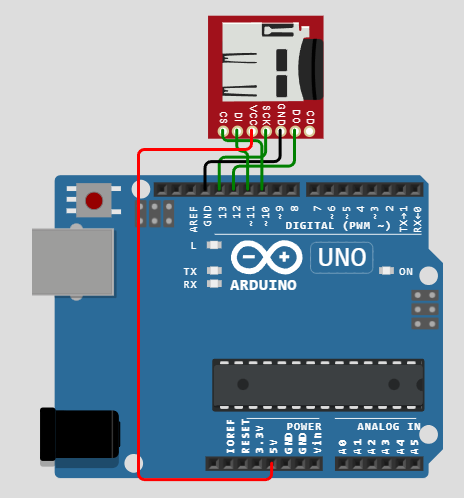

# Практическое занятие №6
# Работа с устройствами хранения данных МК. 

## Цель работы

Целью практического занятия является получение практических навыков работы со средой моделирования и разработки микроконтроллерных модулей цифровых платформ.

## Теоретическая часть

### Хранение данных на карте памяти в среде Arduino

В данном задании будет использоваться модуль с интерфейсом подключения карты памяти SD (microSD). Это один из наиболее удобных и доступных способов записывать данные с микроконтроллера и затем считывать их компьютером.

### Интерфейс SPI

Для подключения карты памяти используется интерфейс SPI - Serial Peripherial Interface. Интерфейс содержит тактовый сигнал SCL (`Serial Clock`), сигналы MOSI (`Master Output Slave Input`) и MISO (`Master Input Slave Output`), используемые соответственно для тактирования шины SPI и передачи данных с головного на ведомое устройство и обратно. Для установления роли в интерфейсе применяется сигнал SS (`Slave Select`, иногда CS - `Chip Select`).  

<p align="center">
<br>
Рисунок 1 – Подключение карты памяти к пинам SPI Arduino
</p>


### Файловая система

При запуске симуляции Wokwi эмулирует карту памяти с файловой системой FAT16 и добавляет туда все файлы, имеющиеся в проекте. Wokwi. К примеру, Wokwi добавляет файл `wokwi.txt` с текстом

    Hello, SD Card!

Этот файл мы и будем использовать для прототипирования.

## Пример работы с библиотекой SD

Инициализация карты памяти микроконтроллером осуществляется через подключение библиотеки `SD.h` и команду `SD.begin(int CS_PIN)`.

```cpp
#include <SD.h> //подключение библиотеки
#define CS_PIN 10 //задание пина CS

void setup() {
    if (!SD.begin(CS_PIN)) {
        Serial.println("Card initialization failed!");
    }
    else {
        Serial.println("Card initialization OK");
    }
}
```

Далее используем встроенный в библиотеку обработчик `File`, через который происходит обращение к файлам на карте памяти. С его помощью открываются и закрываются файлы, а также меняется их содержимое. Подробнее в примерах ниже.

```cpp
File wokwi_txt;

void loop() {
    wokwi_txt = SD.open("wokwi.txt");
    while (wokwi_txt.available()) {
        Serial.write(wokwi_txt.read());
    }
    wokwi_txt.close();
    ...
}
```
Отметим, что в указанных примерах приведена лишь часть кода, отвечающая за определенные функции.
Чтение с карты памяти осуществляется с помощью команды `File.read()` в цикле.

```cpp
File wokwi_txt;

void loop() {
    wokwi_txt = SD.open("wokwi.txt", FILE_WRITE);
    wokwi_txt.println("Line 1");
    wokwi_txt.println("Line 2");
    wokwi_txt.println("Line 3");
    wokwi_txt.println("Line 4");
    wokwi_txt.close();
    ...
}
```

Для записи в файл используются функции `print` и `println`. В целом эти функции сопоставимы с функциями работы с последовательным портом.

## Пример проекта устройства измерения параметров с картой памяти

В проекте используется карта памяти и модуль RTC. Каждую секунду на карту памяти производится запись текущего времени и порядкового номера записи `counter`.
Каждые 10 секунд отображается текущее содержание файла `wokwi.txt`, чтобы в процессе отладки наблюдать корректность выполнения программы.

<p align="center">
<br>
Рисунок 2 – Схема соединений в проекте
</p>


```cpp
#include <SD.h> //подключение библиотеки карты памяти
#include "RTClib.h" //подключение библиотеки RTC 

#define CS_PIN 10

File wokwi_txt; //обработчик для файловой системы
RTC_DS1307 rtc; //обработчик для модуля RTC

void setup() {
  Serial.begin(115200);

  Serial.println("Initializing SD card... ");

  if (!SD.begin(CS_PIN)) { //проверяем, что подключена карта памяти
    Serial.println("Card initialization failed!");
  }
  else {
    Serial.println("Card initialization OK;");
  }

  if (!rtc.begin()) { //проверяем, что подключен RTC
    Serial.println("RTC initialization failed!");
  }
  else {
    Serial.println("RTC initialization OK");
  }
}


int last_second = 0; //последняя секунда, в которую была произведена запись
int counter = 0; //счетчик прошедших записей в файл

void loop() {
  DateTime now = rtc.now();
  if (now.second() != last_second) { //прошло больше секунды
    last_second = now.second();
    counter++;

    //производим запись в файл

    wokwi_txt = SD.open("wokwi.txt", FILE_WRITE);
    wokwi_txt.print(now.timestamp(DateTime::TIMESTAMP_FULL));
    wokwi_txt.print("\t");
    wokwi_txt.println(counter);
    wokwi_txt.close();

    //запись в формате "2023-12-31T23:59:59  21\n"

    //для проверки результата каждую десятую запись выводим содержание файла wokwi_txt
    if (counter % 10 == 0) {
      Serial.println("!!! wokwi.txt file:");
      wokwi_txt = SD.open("wokwi.txt");
      while (wokwi_txt.available()) {
        Serial.write(wokwi_txt.read());
      }
      wokwi_txt.close();
    }
  }
  
}
```

Содержание файла `libraries.txt`:
```
    # Automatically added based on includes:
    SD
    RTClib
    # ---
```

Содержание файла `diagram.json`:

```json
{
  "version": 1,
  "author": "Uri Shaked",
  "editor": "wokwi",
  "parts": [
    { "type": "wokwi-arduino-uno", "id": "uno", "top": 71.32, "left": -100.01, "attrs": {} },
    {
      "type": "wokwi-microsd-card",
      "id": "sd1",
      "top": -55.03,
      "left": -12.53,
      "rotate": 90,
      "attrs": {}
    },
    { "type": "wokwi-ds1307", "id": "rtc1", "top": 301.8, "left": 182.5, "attrs": {} }
  ],
  "connections": [
    [ "sd1:SCK", "uno:13", "green", [ "v18", "h-31" ] ],
    [ "sd1:GND", "uno:GND.1", "black", [ "v21", "h-48" ] ],
    [ "sd1:DO", "uno:12", "green", [ "v24", "h-42" ] ],
    [ "sd1:DI", "uno:11", "green", [ "v14", "h6" ] ],
    [ "sd1:CS", "uno:10", "green", [ "v7", "h21" ] ],
    [ "uno:5V", "sd1:VCC", "red", [ "v11", "h-89", "v-220", "h79" ] ],
    [ "rtc1:5V", "uno:5V", "red", [ "h0" ] ],
    [ "rtc1:GND", "uno:GND.2", "black", [ "h0" ] ],
    [ "rtc1:SDA", "uno:A4", "green", [ "h0" ] ],
    [ "rtc1:SCL", "uno:A5", "green", [ "h0" ] ]
  ],
  "dependencies": {}
}
```

## Список рекомендуемой литературы
1.	https://docs.wokwi.com/parts/wokwi-arduino-uno - Общие сведения о плате Arduino Uno
2.  https://docs.arduino.cc/learn/programming/sd-guide#examples - Примеры кода для взаимодействия с картой памяти с библиотекой `SD`
3.  https://wokwi.com/projects/310692660849410626 - пример wokwi с другой библиотекой `SdFat`, который позволяет посмотреть содержание файловой системы FAT16 на карте памяти в симуляторе
4.  https://docs.wokwi.com/parts/wokwi-ds1307 - Работа модуля RTC в среде Wokwi
