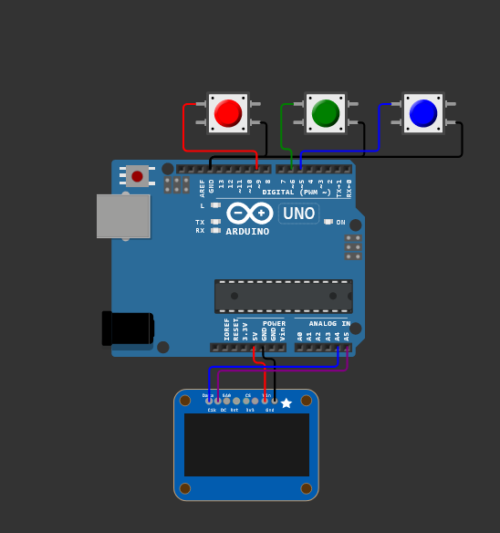
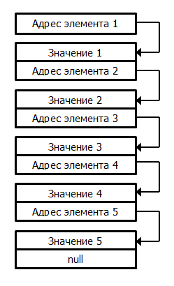
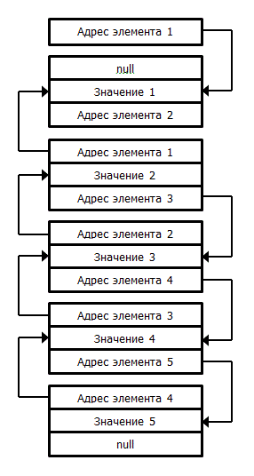

# Практическое занятие №7
## Разработка иерархического меню конфигурации микроконтроллерного модуля. 


## Цель работы
Целью практического занятия является получение практических навыков работы со средой моделирования и разработки микроконтроллерных модулей цифровых платформ.

## Теоретическая часть

Множество устройств цифровых платформ экологического и метеорологического мониторинга для расширения возможностей взаимодействия с пользователем используется меню на дисплее. Существует множество способов его реализации. Самая простая реализация это деление на "экраны" и строки. Каждому экрану соответсвует свой набор строк. Такая структура соответствует двумерному массиву. Можно создать еще один двумерный массив, который будет хранить в себе вызываемые функции, при выборе пункта меню в соответствии с активным экраном. У него должна быть одинаковая индексация экранов и выполняемых функций в соответсвии с пунктом меню. 

При этом под экраном понимается не сам дисплей, а одна инстанция меню, аналогично нескольким рабочим столам на современных смартфонах.

В представленной реализации используется массив структур, который соотвествует одному экрану. Реализован экран "main_menu". Внутри этой структуры хранится название пункта меню и `callback` (вызов) на функцию, которая должна выполняться при выборе этого пункта. В представленной реализации используется только один экран для отрисовки меню. Для создания возможности переключения нескольких экранов необходимо создать двумерный массив элементов ` menu_t `, в котором добавляется адресация по экрану.


<p align="center">
<br>
Рисунок 1 – Cхема подключения
</p>

 Структура программы main.c
```cpp
#include <U8g2lib.h>
#include <Bounce2.h>

#define COM_SPEED_115200 115200
#define BUTTONS_COUNT 3

Bounce * buttons = new Bounce[BUTTONS_COUNT]; ///< Кнопки
typedef enum EButtonType{  // Типы действий, за которые отвечают кнопки
  EButtonType_Up = 0, ///< курсор вверх
  EButtonType_Down,   ///< курсор вниз
  EButtonType_Select, ///< выбор меню
  EButtonType_MaxType = EButtonType_Select 
}button_type_t;

typedef struct SbuttonsStruct // структура, отвечающая за кнопки
{
  button_type_t button_type;  // тип действия
  byte button_pin;            // номер пина кнопки
}buttons_struct_t;

static buttons_struct_t buttons_pins[] = {
  {EButtonType_Up, 9}, {EButtonType_Down, 5}, {EButtonType_Select, 6}
  };  // Инициализируем структуру для всех кнопок

U8X8_SSD1306_128X64_NONAME_HW_I2C display(U8X8_PIN_NONE); ///< Дисплей

#define MENU_ELEMS_COUNT 5 
#define MAX_MENU_NAME_LEN 15

typedef struct SMenu{ // стуктура меню
  char name[MAX_MENU_NAME_LEN]; // название пункта меню
  void (*menu_item_cb)(void* param);  //  callback. Функция вызываемая при выборе пункта меню
}menu_t;

// Прототипы функций-действий при выборе пункта меню
void MainMenuFunc0(void* param);
void MainMenuFunc1(void* param);
void MainMenuFunc2(void* param);
void MainMenuFunc3(void* param);
void MainMenuFunc4(void* param);

menu_t main_menu[MENU_ELEMS_COUNT]= // Инициализируем структуру меню
{
  {"Option 0", MainMenuFunc0},
  {"Option 1", MainMenuFunc1},
  {"Option 2", MainMenuFunc2},
  {"Option 3", MainMenuFunc3},
  {"Option 4", MainMenuFunc4},
};

int cursor=0; //текущая позция курсора в меню 

void setup() 
{
  uint8_t i;
  Serial.begin(COM_SPEED_115200); //Инициализация последовательного соединения и задача скорости передачи данных

  // Включение подтягивающих резисторов на контактах кнопок.
  for (i = 0; i < BUTTONS_COUNT; i++) 
  {// Настройка кнопок
    buttons[i].attach(buttons_pins[i].button_pin, INPUT_PULLUP); 
    buttons[i].interval(25); 
  }

  // Настрйока дисплея
  display.begin(); 
  display.setPowerSave(0);
  display.setFont(u8x8_font_pxplusibmcgathin_f);

  showMenu();
}

void loop() 
{
  uint32_t i;
  for (i = 0; i < BUTTONS_COUNT; i++) 
  {// Обходим все существующие кнопки
    buttons[i].update(); // Обновляем состояние кнопки
    if (buttons[i].fell()) 
    { // Если кнопка нажата
      switch(i)
      {// Выбираем за какое действие отвечает кнопка и выполняем его
        case EButtonType_Select:
        {// Кнопка выбора
          main_menu[cursor].menu_item_cb(NULL);
          break;
        }
        case EButtonType_Up:
        {// Кнопка поднятие курсора вверх
          display.setCursor(0,cursor);
          display.print(' ');// Стираем старый курсор
          cursor--;
          if (cursor < 0) 
          {// Если поднимаем курсор выше самого верхнего элемента, то перебрасываем его на самый нижний
            cursor = (MENU_ELEMS_COUNT - 1);
          }
          display.setCursor(0,cursor);  // рисуем новый курсор
          display.print('>');
        break;
        }
        case EButtonType_Down:
        {// Кнопкая опускания курсора
          display.setCursor(0,cursor);
          display.print(' ');// Стираем старый кусрор
          cursor++;
          if (cursor > (MENU_ELEMS_COUNT - 1)) 
          {// Если опускаем курсор нижне самого нижнего элемента, то перебрасываем его на начало
            cursor = 0;
          }
          display.setCursor(0,cursor);// Рисуем новый курсор
          display.print('>');
          break;
        }
        default:
        {
          break;
        }
      }
    } 
  }
}

void showMenu()
{
  int i;
  cursor=0;
  display.clearDisplay(); // Очищаем дисплей
  for (i = 0; i < MENU_ELEMS_COUNT; i++) 
  {// Рисуем меню
    display.drawString(2, i, main_menu[i].name);
  }
  display.setCursor(0,0);// Устанавливаем курсор на начальную позицию
  display.print('>');
}

// Реализации функций-действий при выборе пункта меню
void MainMenuFunc0(void* param)
{
  Serial.println("Execute choice 0");
}
void MainMenuFunc1(void* param)
{
  Serial.println("Execute choice 1");
}
void MainMenuFunc2(void* param)
{
  Serial.println("Execute choice 2");
}
void MainMenuFunc3(void* param)
{
  Serial.println("Execute choice 3");
}
void MainMenuFunc4(void* param)
{
  Serial.println("Execute choice 4");
}
```

libraries.txt:
```
Bounce2
U8g2
```
diagram.json:
```json
{
    "version": 1,
    "author": "Vladislav Dymnikov",
    "editor": "wokwi",
    "parts": [
      { "id": "uno", "type": "wokwi-arduino-uno", "top": 70, "left": 20 },
      { "id": "ssd1306", "type": "wokwi-ssd1306", "left": 100, "top": 300 },
      {
         "id": "btn-red",
         "type": "wokwi-pushbutton",
         "attrs": { "color": "red" },
         "top": 0,
         "left": 120
       },
      {
        "id": "btn-green",
        "type": "wokwi-pushbutton",
        "top": 0,
        "left": 220,
        "attrs": { "color": "green" }
      },
      {
        "id": "btn-blue",
        "type": "wokwi-pushbutton",
        "top": 0,
        "left": 320,
        "attrs": { "color": "blue" }
      }
    ],
    "connections": [
      ["uno:GND.2", "ssd1306:GND", "black", ["v12", "*", "h0"]],
      ["uno:5V", "ssd1306:VIN", "red", ["v16", "*", "h0"]],
      ["uno:A4", "ssd1306:DATA", "blue", ["v20", "*", "h0"]],
      ["uno:A5", "ssd1306:CLK", "purple", ["v24", "*", "h0"]],
      ["uno:GND.1", "btn-blue:2.r", "black", ["v-12", "*", "h6"]],
      ["uno:GND.1", "btn-green:2.r", "black", ["v-12", "*", "h6"]],
      ["uno:GND.1", "btn-red:2.r", "black", ["v-12", "*", "h6"]],
      ["uno:9", "btn-red:1.l", "red", ["v-18", "*", "h-12"]],
      ["uno:6", "btn-green:1.l", "green", ["v-20", "*", "h-12"]],
      ["uno:5", "btn-blue:1.l", "blue", ["v-18", "*", "h-12"]]
  
    ]
  }
  
```
Исследуйте этот код в симуляторе Wokwi, после запуска симуляции убедитесь, что кнопки соответствуют своему функционалу. Теперь устройством можно управлять во время его работы, например корректировать частоту измерений.

Меню может быть многоуровневым. Каждый пункт может открывать новые разделы меню. Это еще один пример более сложной реализации. В таком случае используются двусвязные списки.

Прежде, чем перейти к двусвязным спискам, рассмотрим односвязные:

<p align="center">
<br>
Рисунок 1 – Односвязный список
</p>

В таком списки каждый элемент знает информацию (адрес) о следующем. Благодаря этой информации он может обратиться(перейти в случае с меню) к следующему за ним элементу. 

Двусвязные списки графически можно изобразить так. 

<p align="center">
<br>
Рисунок 1 – Двунаправленный список
</p>

В таком случае каждый элемент (пункт) меню имеет информацию (адрес) о предыдущем и следующем элементах. По этой информации можно обращаться как к предыдущему, так и к следующему элементу.

Примером более сложной реализации будет являться создание из меню редактора. Это позволит задавать различные параметры путем ввода их с клавиатуры.

Wokwi позволяет просматривать существующие реализации определенных алгоритмов. **Рекомендуется изучить другие возможные способы создания меню:**

https://wokwi.com/projects/323967017900048980

https://wokwi.com/projects/376035378380661761

## Список рекомендуемой литературы
1.  https://wokwi.com
2.	https://docs.wokwi.com/parts/wokwi-arduino-uno - Общие сведения о плате Arduino Uno
