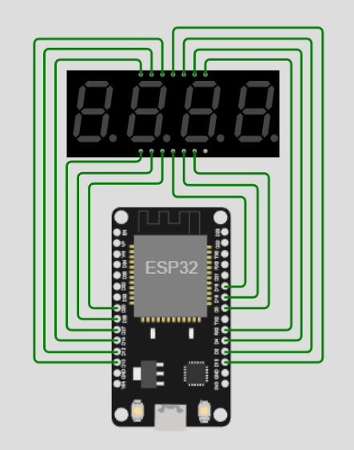
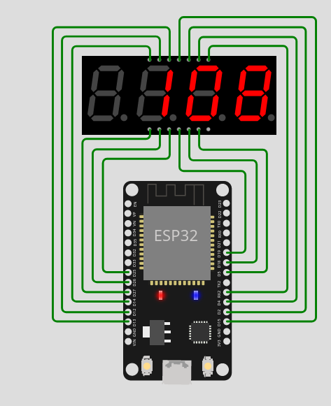
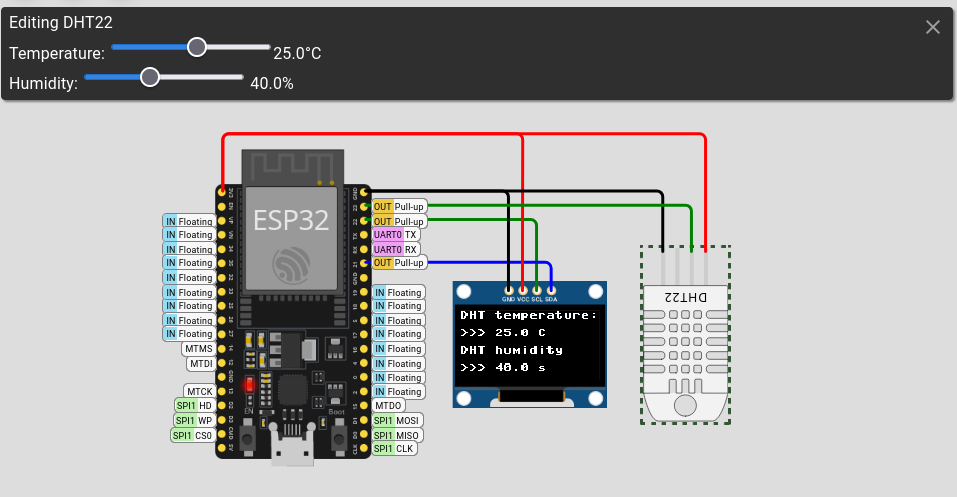
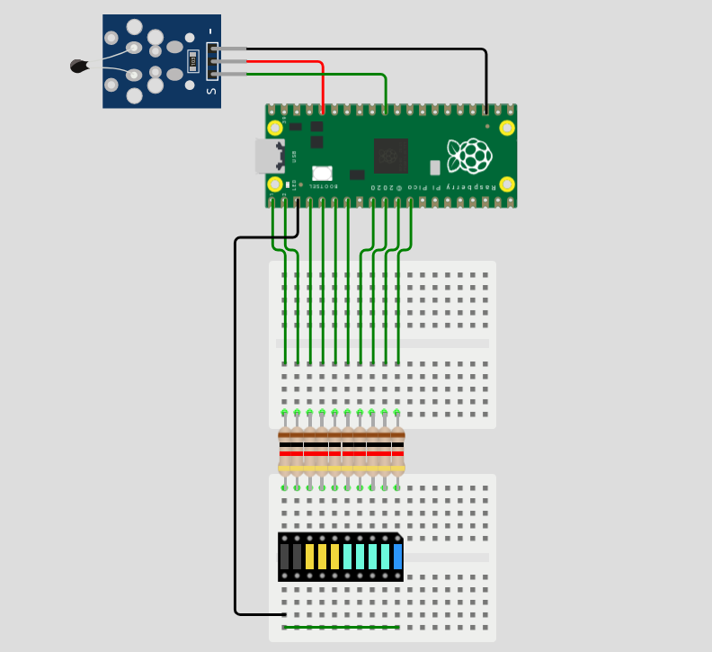
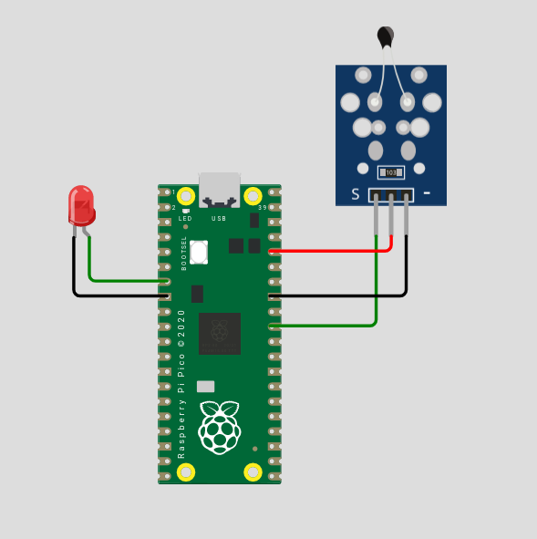

# Практическое занятие №8
# Знакомство с платами быстрого прототипирования
## ESP32, Raspberry Pi Pico. Основы работы с ЯП MicroPython.

## Цель работы

Целью практического занятия является получение практических навыков работы со средой моделирования и разработки микроконтроллерных модулей цифровых платформ экологического и метеорологического мониторинга

## Теоретическая часть

В данном занятии будут рассмотрены отладочные платы быстрого прототипирования на базе микроконтроллеров ESP32 и Raspberry Pi Pico, поддерживающие программирование в среде Arduino. Указанные платы имеют расширенный функционал в сравнении с большинством плат линейки Arduino, например встроенные приемопередающие модули, а также могут программироваться на ЯП, отличных от C++.

## Микроконтроллерные модули ESP32

ESP32 — серия недорогих микропроцессоров с малым энергопотреблением китайской компании Espressif Systems.
Микроконтроллеры семейства ESP32 вышли на рынок в 2015 году и с тех пор занимают значительную долю рынка микроэлектроники
как для задачи прототипирования, так и для создания законченных устройств и приборов.

Espressif ESP32 — вычислительный процессор, совмещённый с модемами Bluetooth и Wi-Fi, разработанный для встраиваемых,
портативных решений, расчитан на работу от аккумуляторных источников питания и батарей, чем отлично подходит
для цели мониторинга экологических параметров в распределённых беспроводных сенсорных системах.

Микроконтроллер ESP32 можно встретить на множестве отладочных плат, также он поддерживается в среде Wokwi.

Помимо этого указанные микроконтроллеры и платы на их основе широко поддерживаются сообществом открытого программного и аппаратного обеспечения, на их основе разработаны сотни модулей, обеспечивающих работу различных Умных платформ, например умного дома, города. Наглядным примером таких модулей является система ESPHome, в которой существует множество реализаций различных измерительных устройств и автоматики.

### Программирование ESP32 на C

Как и в предыдущих практических работах, существует возможность программирования платы ESP32 на C-подобном языке среды Arduino. 
Чтобы в этом убедиться, построим тестовый стенд с сегментным дисплеем (без драйвера) и напишем программу управления им.

<p align="center">
<br>
Рисунок 1 – Подключение сегментного дисплея к ESP32
</p>

Стоит заметить, что в реальных условиях для подключения дисплея необходимо применять токоограничивающие резисторы, чтобы не превышать максимально допустимый ток на пинах ввода-вывода (как правило, 10-20 мА).

Содержание вкладки libraries.txt

```
# Automatically added based on includes:
SevSeg
```

Содержание вкладки diagram.json:

```json
{
  "version": 1,
  "author": "Anderson Costa",
  "editor": "wokwi",
  "parts": [
    { "type": "wokwi-esp32-devkit-v1", "id": "esp", "top": 160, "left": 80, "attrs": {} },
    {
      "type": "wokwi-7segment",
      "id": "sevseg1",
      "top": 40,
      "left": 40,
      "attrs": { "digits": "4" }
    }
  ],
  "connections": [
    [ "esp:TX0", "$serialMonitor:RX", "", [] ],
    [ "esp:RX0", "$serialMonitor:TX", "", [] ],
    [ "esp:D14", "sevseg1:DIG1", "green", [ "h-55", "v-250", "h77" ] ],
    [ "esp:D12", "sevseg1:A", "green", [ "h-65", "v-270", "h97" ] ],
    [ "esp:D13", "sevseg1:F", "green", [ "h-74", "v-288", "h121" ] ],
    [ "esp:RX2", "sevseg1:CLN", "green", [ "h59", "v-241", "h-79" ] ],
    [ "esp:D4", "sevseg1:B", "green", [ "h68", "v-259", "h-94" ] ],
    [ "esp:D2", "sevseg1:DIG3", "green", [ "h77", "v-279", "h-112" ] ],
    [ "esp:D15", "sevseg1:DIG2", "green", [ "h87", "v-298", "h-133" ] ],
    [ "esp:D27", "sevseg1:E", "green", [ "h-45", "v-150", "h64" ] ],
    [ "esp:D26", "sevseg1:D", "green", [ "h-35", "v-130", "h66" ] ],
    [ "esp:D25", "sevseg1:DP", "green", [ "h-25", "v-111", "h66" ] ],
    [ "esp:D5", "sevseg1:DIG4", "green", [ "h39", "v-120", "h-67" ] ],
    [ "esp:D18", "sevseg1:G", "green", [ "h29", "v-100", "h-58" ] ],
    [ "esp:D19", "sevseg1:C", "green", [ "h18", "v-80", "h-62" ] ]
  ]
}

```

Основной код программы

```cpp
#include "SevSeg.h"  //Библиотека сегментного индикатора

SevSeg sevseg;  //Создание объекта, соответствующего семисегментному дисплею

byte numDigits = 4; //параметры подключения дисплея
byte digitPins[] = {14, 15, 2, 5}; //общие аноды цифр
byte segmentPins[] = {12, 4, 19, 26, 27, 13, 18, 25}; //катоды светодиодов

void setup() {
  sevseg.begin(COMMON_ANODE, numDigits, digitPins, segmentPins, false, false, false, false);
  //инициализация объекта SevSeg семисегментного дисплея
  //некоторые параметры опущены и не важны в симуляции
}

void loop() {
  uint16_t timer = millis() / 250; //счётчик, который вычисляется из встроенного таймера миллисекунд
  sevseg.setNumber(timer); //установка новых чисел на счетчик
  sevseg.refreshDisplay(); //применение изменений
  delay(1);
}
```


<p align="center">
<br>
Рисунок 2 – Результат работы отладочного стенда
</p>

### Программирование ESP32 на MicroPython

Другим вариантом программирования ESP32 является язык программирования MicroPython, который, как следует из названия, стал производным от Python.

Micropython имеет некоторые отличия от среды Arduino:
* использование библиотеки machine для работы с периферией, такой как пины ввода-вывода и шину I2C, вместо использования предопределённых функций
* другой синтаксис языка
* неявное использование типов данных (int, bool)
* отсутствие разделения на `setup()` и `loop()`

Однако основным отличием является простота и наглядность ЯП Micropython. Приведем следующий пример работы с платой ESP32,используем уже знакомый датчик DHT22 и OLED дисплей для вывода информации с датчика. Процедуры работы с дисплеем вынесены в отдельную функцию, а для шины I2C используется функция SoftI2C, отображающая одну из особенностей платы ESP32 - программно-определяемую шину I2C, не привязанную к конкретным пинам микроконтроллера.

_________________________________________
`Hint:` MicroPython полностью наследует структуру ЯП Python, то есть в отличии от C/C++, наличие или отсутствие табуляции/пробела может вызвать ошибки в коде. Старайтесь использовать одну схему на протяжении всего кода. Для отступа, который используется для явного обозначения текста функций или условий можно использовать *один tab* или *четыре пробела*.

`ПРИМЕР` (выполнять в wokwi его не нужно)

```python
def FUNCTION(attribute1, attribute2): # Объявление функции
  #здесь в качестве отступа используется один символ табуляции
  function text here #Текст функции имеет отступы
#Здесь функция закончилась

#Аналогично с условиями и циклами
if(a>b):
  FUNCTION(a)
  print(a)
else:
  FUNCTION(b)
  print(b)
    #Этот коментарий имеет 4 пробела в качестве отступа, на этом месте некоторые версии Python выдадут ошибку
    #поскольку совмещать два типа отступа в одном файле не считается корректным
    print('hello')
    
```
_________________________________________


Файл diagram.json
```json
{
  "version": 1,
  "author": "Uri Shaked",
  "editor": "wokwi",
  "parts": [
    {
      "type": "board-esp32-devkit-c-v4",
      "id": "esp",
      "top": 9.6,
      "left": -100.76,
      "attrs": { "env": "micropython-20231005-v1.21.0" }
    },
    { "type": "board-ssd1306", "id": "oled1", "top": 99.14, "left": 57.83, "attrs": {} },
    {
      "type": "wokwi-dht22",
      "id": "dht1",
      "top": 77.1,
      "left": 186.6,
      "rotate": 180,
      "attrs": {}
    }
  ],
  "connections": [
    [ "esp:TX", "$serialMonitor:RX", "", [] ],
    [ "esp:RX", "$serialMonitor:TX", "", [] ],
    [ "oled1:SCL", "esp:22", "green", [ "v0" ] ],
    [ "oled1:SDA", "esp:21", "blue", [ "v-19.2", "h-124.73" ] ],
    [ "oled1:GND", "esp:GND.2", "black", [ "v-67.2", "h-96" ] ],
    [ "oled1:VCC", "esp:3V3", "red", [ "v-28.8", "h0.15", "v-76.8", "h-201.75" ] ],
    [ "dht1:GND", "esp:GND.2", "black", [ "v0" ] ],
    [ "dht1:VCC", "esp:3V3", "red", [ "v-79.2", "h-324.75" ] ],
    [ "dht1:SDA", "esp:23", "green", [ "v0" ] ]
  ],
  "dependencies": {}
}
```
Основной код программы:
```python
import machine #библиотека для работы с периферией платы
import ssd1306 #библиотека для работы с дисплеем SSD1306
import dht #библиотека для работы с DHT датчиками
import utime #библиотека времени

### Настройка пинов ввода-вывода

oled_scl = machine.Pin(22)
oled_sda = machine.Pin(21)
dht_pin = machine.Pin(23)

### Инициализация интерфейсов

# OLED дисплей
i2c = machine.SoftI2C(scl=oled_scl, sda=oled_sda) #подключение программной шины I2C
oled = ssd1306.SSD1306_I2C(128, 64, i2c) #подключение дисплея 128*64 пикселя по шине I2C

# DHT22
dht22 = dht.DHT22(dht_pin) #подключение датчика DHT22


def update_oled(temperature, humidity): #подпрограмма для 
    oled.fill(0)
    oled.text("DHT temperature:", 0, 0)
    oled.text(">>> {} C".format(temperature), 0, 16)
    oled.text("DHT humidity", 0, 32)
    oled.text(">>> {} s".format(humidity), 0, 48)
    oled.show()


while True: #основной цикл программы 
    dht22.measure() #начало измерения  DHT22
    utime.sleep(1) #сон на 1 секунду
    update_oled(dht22.temperature(), dht22.humidity())
    #отображение показаний через процедуру update_oled()
```
<p align="center">
<br>
Рисунок 3 - Стенд с датчиком DHT22 и OLED дисплеем
</p>

## Разработка на микроконтроллере Raspberry Pi Pico

Еще один выдающийся микроконтроллер последних лет, составляющий конкуренцию знакомым нам Arduino платам на чипах Atmel - микроконтроллер Raspberry Pi Pico RP2040. Это невероятно дешёвый микроконтроллер со стоимостью в полтора доллара при покупке большой партией. Стоимость конечного устройства (в нашем случае, отладочной платы), а также приличные характеристики - подключаемая FLASH память программ до 16 МБ, 2 ядра частотой до 133 МГц и оперативная память в 264 КБ - сделали этот процессор одним из лучших решений для разработки, когда Arduino уже не хватает.

RP2040 - кодовое название микроконтроллера - также можно программировать из среды Arduino или MicroPython.

### Программирование RP Pico на Arduino

Попробуем использовать отладочную плату с Raspberry Pi Pico для еще одного примера в среде Wokwi. Подключим к плате светодиодный модуль (led-bar-graph) и токоограничивающие резисторы. Для удобства воспользуемся макетными платами breadboard. Светодиодный индикатор будет отражать температуру на NTC.

Содержание файла diagram.json

```json
{
  "version": 1,
  "author": "Uri Shaked",
  "editor": "wokwi",
  "parts": [
    { "type": "wokwi-breadboard-mini", "id": "bb1", "top": 17.8, "left": -12, "attrs": {} },
    { "type": "wokwi-breadboard-mini", "id": "bb2", "top": -145.4, "left": -12, "attrs": {} },
    {
      "type": "wokwi-pi-pico",
      "id": "pico",
      "top": -325.5,
      "left": 38.15,
      "rotate": 270,
      "attrs": { "env": "arduino-community" }
    },
    {
      "type": "wokwi-resistor",
      "id": "r1",
      "top": -4.8,
      "left": -29.35,
      "rotate": 90,
      "attrs": { "value": "1000" }
    },
    {
      "type": "wokwi-resistor",
      "id": "r2",
      "top": -4.8,
      "left": -19.75,
      "rotate": 90,
      "attrs": { "value": "1000" }
    },
    {
      "type": "wokwi-resistor",
      "id": "r3",
      "top": -4.8,
      "left": -10.15,
      "rotate": 90,
      "attrs": { "value": "1000" }
    },
    {
      "type": "wokwi-resistor",
      "id": "r4",
      "top": -4.8,
      "left": -0.55,
      "rotate": 90,
      "attrs": { "value": "1000" }
    },
    {
      "type": "wokwi-resistor",
      "id": "r5",
      "top": -4.8,
      "left": 9.05,
      "rotate": 90,
      "attrs": { "value": "1000" }
    },
    {
      "type": "wokwi-resistor",
      "id": "r6",
      "top": -4.8,
      "left": 18.65,
      "rotate": 90,
      "attrs": { "value": "1000" }
    },
    {
      "type": "wokwi-resistor",
      "id": "r7",
      "top": -4.8,
      "left": 28.25,
      "rotate": 90,
      "attrs": { "value": "1000" }
    },
    {
      "type": "wokwi-resistor",
      "id": "r8",
      "top": -4.8,
      "left": 37.85,
      "rotate": 90,
      "attrs": { "value": "1000" }
    },
    {
      "type": "wokwi-led-bar-graph",
      "id": "bargraph1",
      "top": 33.4,
      "left": 24.2,
      "rotate": 90,
      "attrs": { "color": "BCYR" }
    },
    {
      "type": "wokwi-ntc-temperature-sensor",
      "id": "ntc1",
      "top": -333.4,
      "left": -163.8,
      "attrs": {}
    },
    {
      "type": "wokwi-resistor",
      "id": "r9",
      "top": -4.8,
      "left": 47.45,
      "rotate": 90,
      "attrs": { "value": "1000" }
    },
    {
      "type": "wokwi-resistor",
      "id": "r10",
      "top": -4.8,
      "left": 57.05,
      "rotate": 90,
      "attrs": { "value": "1000" }
    }
  ],
  "connections": [
    [ "$serialMonitor:RX", "pico:GP0", "", [] ],
    [ "bb1:10b.j", "bb1:9b.j", "green", [ "v0" ] ],
    [ "bb1:9b.j", "bb1:8b.j", "green", [ "v0" ] ],
    [ "bb1:8b.j", "bb1:7b.j", "green", [ "v0" ] ],
    [ "bb1:7b.j", "bb1:6b.j", "green", [ "v0" ] ],
    [ "bb1:6b.j", "bb1:5b.j", "green", [ "v0" ] ],
    [ "bb1:5b.j", "bb1:4b.j", "green", [ "v0" ] ],
    [ "bb1:4b.j", "bb1:3b.j", "green", [ "v0" ] ],
    [ "bb1:3b.j", "bb1:2b.j", "green", [ "v0" ] ],
    [ "bb1:2b.j", "bb1:1b.j", "green", [ "v0" ] ],
    [ "pico:GP0", "bb2:1b.f", "green", [ "v38.4", "h9.6" ] ],
    [ "bb2:2b.f", "pico:GP1", "green", [ "v-86.4", "h-9.6" ] ],
    [ "bb2:3b.f", "pico:GP2", "green", [ "v0" ] ],
    [ "bb2:4b.f", "pico:GP3", "green", [ "v0" ] ],
    [ "bb2:5b.f", "pico:GP4", "green", [ "v-124.8" ] ],
    [ "pico:GP5", "bb2:6b.f", "green", [ "v124.8" ] ],
    [ "bb2:7b.f", "pico:GP6", "green", [ "v-86.4", "h9.6" ] ],
    [ "bb2:8b.f", "pico:GP7", "green", [ "v-86.4", "h9.6" ] ],
    [ "pico:GND.1", "bb1:1b.i", "black", [ "v28.8", "h-48", "v288", "h38.4" ] ],
    [ "r1:2", "bb1:1t.a", "", [ "$bb" ] ],
    [ "r1:1", "bb2:1b.j", "", [ "$bb" ] ],
    [ "r2:2", "bb1:2t.a", "", [ "$bb" ] ],
    [ "r2:1", "bb2:2b.j", "", [ "$bb" ] ],
    [ "r3:2", "bb1:3t.a", "", [ "$bb" ] ],
    [ "r3:1", "bb2:3b.j", "", [ "$bb" ] ],
    [ "r4:2", "bb1:4t.a", "", [ "$bb" ] ],
    [ "r4:1", "bb2:4b.j", "", [ "$bb" ] ],
    [ "r5:2", "bb1:5t.a", "", [ "$bb" ] ],
    [ "r5:1", "bb2:5b.j", "", [ "$bb" ] ],
    [ "r6:2", "bb1:6t.a", "", [ "$bb" ] ],
    [ "r6:1", "bb2:6b.j", "", [ "$bb" ] ],
    [ "ntc1:GND", "pico:GND.5", "black", [ "h0" ] ],
    [ "ntc1:VCC", "pico:3V3", "red", [ "h0" ] ],
    [ "ntc1:OUT", "pico:GP26", "green", [ "h0" ] ],
    [ "r7:2", "bb1:7t.a", "", [ "$bb" ] ],
    [ "r7:1", "bb2:7b.j", "", [ "$bb" ] ],
    [ "r8:2", "bb1:8t.a", "", [ "$bb" ] ],
    [ "r8:1", "bb2:8b.j", "", [ "$bb" ] ],
    [ "r9:2", "bb1:9t.a", "", [ "$bb" ] ],
    [ "r9:1", "bb2:9b.j", "", [ "$bb" ] ],
    [ "r10:2", "bb1:10t.a", "", [ "$bb" ] ],
    [ "r10:1", "bb2:10b.j", "", [ "$bb" ] ],
    [ "bb2:9b.f", "pico:GP8", "green", [ "v-86.4", "h9.6", "v-38.4" ] ],
    [ "pico:GP9", "bb2:10b.f", "green", [ "v38.4", "h-9.6" ] ],
    [ "bargraph1:A1", "bb1:10t.e", "", [ "$bb" ] ],
    [ "bargraph1:A2", "bb1:9t.e", "", [ "$bb" ] ],
    [ "bargraph1:A3", "bb1:8t.e", "", [ "$bb" ] ],
    [ "bargraph1:A4", "bb1:7t.e", "", [ "$bb" ] ],
    [ "bargraph1:A5", "bb1:6t.e", "", [ "$bb" ] ],
    [ "bargraph1:A6", "bb1:5t.e", "", [ "$bb" ] ],
    [ "bargraph1:A7", "bb1:4t.e", "", [ "$bb" ] ],
    [ "bargraph1:A8", "bb1:3t.e", "", [ "$bb" ] ],
    [ "bargraph1:A9", "bb1:2t.e", "", [ "$bb" ] ],
    [ "bargraph1:A10", "bb1:1t.e", "", [ "$bb" ] ],
    [ "bargraph1:C1", "bb1:10b.f", "", [ "$bb" ] ],
    [ "bargraph1:C2", "bb1:9b.f", "", [ "$bb" ] ],
    [ "bargraph1:C3", "bb1:8b.f", "", [ "$bb" ] ],
    [ "bargraph1:C4", "bb1:7b.f", "", [ "$bb" ] ],
    [ "bargraph1:C5", "bb1:6b.f", "", [ "$bb" ] ],
    [ "bargraph1:C6", "bb1:5b.f", "", [ "$bb" ] ],
    [ "bargraph1:C7", "bb1:4b.f", "", [ "$bb" ] ],
    [ "bargraph1:C8", "bb1:3b.f", "", [ "$bb" ] ],
    [ "bargraph1:C9", "bb1:2b.f", "", [ "$bb" ] ],
    [ "bargraph1:C10", "bb1:1b.f", "", [ "$bb" ] ]
  ],
  "dependencies": {}
}
```

Основной код программы:

```cpp
void setup() {
  //подключение пинов 0..9
  for (int i = 0; i < 10; i++) {
    pinMode(i, OUTPUT);
    digitalWrite(i, HIGH);
    delay(100);
    digitalWrite(i, LOW);
  }

  pinMode(26, INPUT);
}

void loop() {
  const float BETA = 3950;
  int analogValue = analogRead(26);
  float celsius = 1 / (log(1 / (1023. / analogValue - 1)) / BETA + 1.0 / 298.15) - 273.15;
  
  float limit[10] = {50, 35, 25, 15, 10, 5, 0, -5, -15, -25};
  
  for (int i = 0; i < 10; i++) {
    bool is_greater = celsius >= limit[i];
    digitalWrite(i, is_greater);
  }

  delay(1000);
}

```
<p align="center">
<br>
Рисунок 4 – Отладочный стенд с RP2040
</p>

### Программирование RP2040 на Micropython

Аналогичным образом проверим работу Raspberry Pi Pico с языком программирования Micropython. Также подключим датчик NTC, но для вывода данных будем использовать светодиод в качестве сигнализации. 

В предыдущей работе поднимался вопрос управления интервалом опроса датчиков. При этом возникала трудность с задержками в основном цикле программы.

В этом примере рассмотрен алгоритм, использующий системное время микроконтроллера (аналог `millis()` в среде Arduino). Здесь основной код программы работает с установленным интервалом (10 мс), а светодиод переключается в зависимости от того, прошло ли `delay_time` миллисекунд с прошлого переключения.


<p align="center">
<br>
Рисунок 5 – Отладочный стенд с RP2040 (MicroPython)
</p>

Содержание вкладки diagrams.json:

```json
{
  "version": 1,
  "author": "Anonymous maker",
  "editor": "wokwi",
  "parts": [
    { "type": "wokwi-pi-pico", "id": "pico", "top": -3.15, "left": 3.6, "attrs": {} },
    {
      "type": "wokwi-led",
      "id": "led1",
      "top": -2.67,
      "left": -65.33,
      "attrs": { "color": "red" }
    },
    {
      "type": "wokwi-ntc-temperature-sensor",
      "id": "ntc1",
      "top": -65.1,
      "left": 85.9,
      "rotate": 90,
      "attrs": {}
    }
  ],
  "connections": [
    [ "pico:GP0", "$serialMonitor:RX", "", [] ],
    [ "pico:GP1", "$serialMonitor:TX", "", [] ],
    [ "pico:GP5", "led1:A", "green", [ "h0" ] ],
    [ "pico:GND.2", "led1:C", "black", [ "h0" ] ],
    [ "ntc1:OUT", "pico:GP26", "green", [ "v0" ] ],
    [ "ntc1:VCC", "pico:3V3", "red", [ "v0" ] ],
    [ "ntc1:GND", "pico:GND.7", "black", [ "v0" ] ]
  ],
  "dependencies": {}
}
```

Основной код программы:

```python
import machine #библиотека работы с периферией
from math import log #функция логарифма из math
import time #библиотека времени

#Описание периферии

led_pin = machine.Pin(5, machine.Pin.OUT) #светодиод
ntc_pin = machine.ADC(26) #АЦП вход для NTC

#Переменные для работы таймера светодиода

last_toggle = 0 #последнее переключение светодиода, мс
delay_time = 500 #интервал переключения

while True:
    #Вычисление температуры

    ntc_raw = ntc_pin.read_u16(); #чтение данных с АЦП, 0..65535
    celsius = ( 1 / (log(1/(65535/ntc_raw-1))/3950 + 1/298.15) - 273)
    #знакомая нам формула преобразования
 
    #Установка интервала моргания светодиода

    if (celsius < 0):
        delay_time = 100 #низкая температура
    else:
        delay_time = 500 #высокая температура

    #асинхронное управление светодиодом, не затрагивающее работу основного цикла

    #если последнее переключение случилось более delay_time миллисекунд
    if time.ticks_diff(time.ticks_ms(), last_toggle) > delay_time:
        #начать новый отсчет
        last_toggle = time.ticks_ms()
        #переключить светодиод
        led_pin.toggle()

    #delay для основного цикла, не влияющий на интервал светодиода

    time.sleep(0.01)
```

Приведённый пример может быть полезным для исправления и улучшения кода предыдущей работы.

## Список рекомендуемой литературы
1. https://docs.wokwi.com/parts/wokwi-pi-pico
2. https://docs.micropython.org/en/latest/library/time.html#time.ticks_diff - описание работы функции `time.ticks_diff()` и других функций библиотеки `time`.
3. https://wokwi.com/projects/305568836183130690 - пример работы с дисплеем SSD1306
