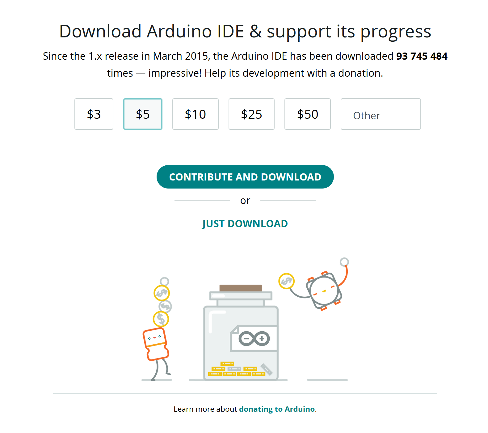
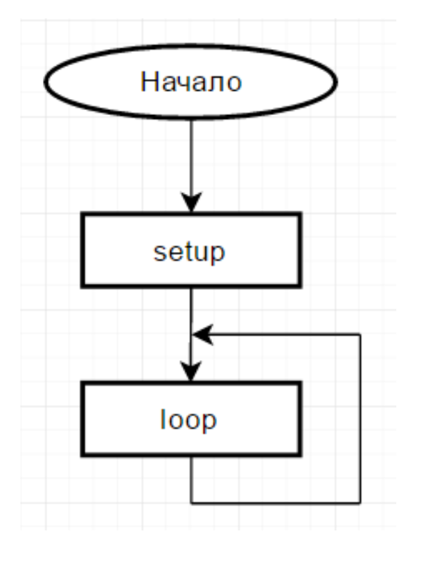

# Практическое занятие №9

# Знакомство с ARDUINO UNI, IDE

## Цель работы

Целью практического занятия является получение практических навыков работы со средой моделирования и разработки микроконтроллерных модулей цифровых платформ экологического и метеорологического мониторинга

## Установка 

Arduino IDE можно скачать в Интернете по адресу основного сайта проекта: www.arduino.cc/en/Main/Software, программное обеспечение свободно распространяется и для скачивания нужно выбрать в разделе  Download the Arduino IDE вариант Windows Installe, а затем JUST DOWNLOAD
<p align="center">
<br>
Рисунок 1 – Окно скачивания программы Arduino IDE
</p>

<p align="center">
<br>
Рисунок 2 –  Кнопка загрузки установочного файла Arduino IDE
</p>

На компьютер необходимо инсталлировать программу Arduino IDE
— в настоящий момент это файл arduino-ide_2.3.4-windows.exe. Его надо
запустить на выполнение с административными полномочиями, принять
условия лицензии GNU LESSER GENERAL PUBLIC LICENSE и
согласиться с предложенным вариантом установки.
На все предупреждения Windows в процессе установки следует
отвечать утвердительно (продолжать установку). Когда установщик
предложит установить драйверы порта, также ответить утвердительно.

<p align="center">
<br>
Рисунок 3 – Принятие Лицензии  
</p>

### Начало работы с Arduino IDE

Среда разработки имеет интуитивно понятный русскоязычный
интерфейс. При запуске установленной Arduino IDE откроется окно, в котором уже содержится заготовка программы. Она
состоит из двух функций: setup и loop. Функция setup содержит команды,
выполняемые одни раз при включении Arduino, — это установка номеров
портов ввода/вывода для управления мониторами и установки скорости
обмена данными между Arduino и компьютером. Функция loop
выполняется бесконечное число раз — до тех пор, пока мы не отключим
питание, фактически она зациклена, алгоритмически это изображено на
рисунке 5.
Интерфейс позволяет реализовать ранее изученные базовые
алгоритмы

<p align="center">
<br>
Рисунок 4 – Окно Arduino IDE 
</p>

<p align="center">
<br>
Рисунок 5 – Типовой алгоритм программы Arduino IDE
</p>

### Запуск IDE и подключение к ARDUINO

Возможности среды позволяют в зависимости от контроллера
Arduino использовать, разные USB-кабели

* для Arduino UNO R3 и Mega — это кабель с разъемом под USB-
принтер с одной стороны и стандартным USB-разъемом с другой;
* для контроллера Nano требуется кабель с разъемом mini-USB;
* для Arduino Micro — это micro-USB, а для программирования
контроллера Arduino Mini и Pro Mini потребуется программатор, так как у
него отсутствует стандартный интерфейс для подключения его к компьютеру.


<p align="center">
<br>
Рисунок 8 –  Варианты USB-кабелей: а) USB для Arduino UNO и Mega; б) кабель для
Arduino Nano; в) micro-USB для Arduino Mini
</p>

Некоторые контроллеры требуют для своей работы нестандартный драйвер. Они требуют установки отдельного драйвера, не входящего в
комплект Arduino IDE, — его название ch341ser.exe. Найти его не трудно,  после установки драйвера проблема будет решена.
Контроллер подключается к ПК через USB интерфейс и  устанавливает связи между ним и оболочкой Arduino IDE. 

Контроллер подключается к ПК через USB интерфейс и устанавливает связи между ним
и оболочкой Arduino IDE. Для этого нужно задать номер порта, к которому подключен контроллер . Если портов много и найти
нужный сложно, рекомендуется запомнить все имеющиеся, а затем
физически отсоединить Arduino от кабеля, и снова проанализировать список портов, – тот, который исчез, и есть нужный. После подключения необходимо выбрать нужный порт – для этого установить соответствующий ему флажок. Иногда для появления порта в списке требуется некоторое время, за которое операционная система компьютера анализирует и проверяет подключенное устройство, так что требуется немного подождать до завершения этого процесса.


<p align="center">
<br>
Рисунок 6 – Выбор нужного порта
</p>

Затем необходимо выбирать тип контроллера Arduino. На рисунке 7  можно видеть, что выбран Arduino/ Genuino Uno

<p align="center">
<br>
Рисунок 7 – Выбор нужного порта
</p>

Если контроллер выбран системой автоматически, необходимо проверить правильность этого выбора. Для некоторых контроллеров
необходимо еще выбрать подвид микроконтроллера, на котором реализована плата Arduino. Название микроконтроллера можно найти на
самой его микросхеме – это, как правило, самая большая микросхема платы и расположена она в ее центре

Загрузка программы. Написанная программа в Arduino IDE загружается в контроллер нажатием кнопки со стрелкой вправо. Оболочка проверит программу на наличие ошибок, а затем переведет ее в двоичный код данных и команд выбранного микроконтроллера и запишет в Arduino.

## Основы программирования Arduino


Платы Arduino программируются на собственном языке программирования, но большая его часть заимоствована из языка C++. Любая программа написанная на языке C++ содержит одну или несколько функций. Одна из них обязательная и является точкой входа в программу - то есть выполняется при запуске.

*Функция в программировании — это подпрограмма (именованный участок программы, выполняющий определенные задачи), которую можно вызвать из другого места программы.* Функции в C++ обычно объявляются в формате:

```cpp
<тип возвращаемых данных> <имя функции> (<аргументы, передаваемые функции>)
{
    <команды, выполняемые в рамках функции> ;
    return <результат функции> ;
}
```
При этом каждое значение в <> представляет собой какой-либо операнд или тип данных.

Тип функции (или тип возвращаемых данных) - тип возвращаемого значения; имя функции - имя, по которому вызывается функция; аргументы ­ перечень аргументов, которые функция использует для своих действий; результат функции ­ переменная определяющее возвращаемое значение функции. Любые блоки операторов (в том числе и содержимое функции) выделяются фигурными скобками.

Если функция ничего не возвращает - то используется пустой тип void. Соответственно, в коде функции строка return() не нужна.

Для использования функции в другой части программы к ней производится обращение по ее имени: 
`<имя функции> (<аргументы, передаваемые функции>)`

Ниже представлен пример простой функции, выполняющей суммирование двух чисел:
```cpp
int sum( int a, int b ) // функция sum целочисленного типа int принимает два числа: a и b
{
  int result;    //явно указываем переменную, хранящую значение суммы
  result = a+b;  //присваиваем переменной значение суммы a и b
  return result; // возвращает результат их сложения
}
```

**В случае Arduino в программе обязательно должны быть две функции: setup и loop.** Пустая программа для Arduino выглядит так:
```cpp
void setup() {
  // put your setup code here, to run once:
}

void loop() {
  // put your main code here, to run repeatedly:
}
```

Содержимое функции setup выполняется сразу при включении или перезагрузке платы. Затем постоянно повторяясь выполняется функция loop.

Комментарии в программе позволяют вам оставить свои пометки (для себя или коллег). Комментирование кода - очень полезная привычка, особенно при написании больших программ в команде. Комментарий никак не влияет на компиляцию программы и служит только для хранения уточнений программиста. В ардуино можно комментировать строку (все, что записано после // - это комментарий). Или можно комментировать блок кода (комментарий между символами /* и */)

```cpp
void setup(){

этот код работает // это комментарий
этот код работает 

/*
это тоже комментарий
*/

этот код работает 

}
```
В этом примере видно, где комментарий написан правильно (серым), а где посчитается за код.

Взглянем на функцию, которую вы запускали ранее еще раз с целью подробного разбора программного кода.
```cpp
#define LED_BUILTIN 27               //В этих строках задаются глобальные переменные, так программа будет знать, что при указании в коде LED_BUILTIN (имя может быть произвольным) - нужно подставить вместо него 27, что указывает на номер разъема, к которому подключен светодиод
#define input 26                     // Аналогично с кнопкой, она подключена к разъему с номером 26

int program(){                       // Создаем новую функцию с именем program
 digitalWrite(LED_BUILTIN, HIGH); // Эта функция включает светодиод. По факту происходит запись значения HIGH (что является логической единицей) в переменную LED_BUILTIN. Поскольку переменная ссылается на 27 разъем, то устройство фактически подает напряжение на него, что и включает светодиод.
 delay(1000);  // Функция ожидания, которая принимает на вход время в миллисекундах.
 digitalWrite(LED_BUILTIN, LOW);// При записи LOW на переменную разъема, на нем устанавливается напряжение 0 Вольт, то есть фактически выключается электропитание - диод гаснет.
 delay(1000); 
 return 0;                          // Поскольку функция типа Int, то она обязательно должна возвращать значение, в этом примере функция всегда возвращает 0, если функция не возвратила 0, то программа получит сообщение об ошибке
}


int buttonState = 0;                 // Переменная для хранения состояния кнопки

void setup() {                       // Обязательная функция setup
     pinMode(LED_BUILTIN, OUTPUT);      //конфигурация разъема к светодиоду как цифрового выхода
     pinMode(input, INPUT);             //конфигурация разъема, к которому подключена кнопка, как цифровой вход
}

void loop() {                       // Основная повторяемая функция
     buttonState = digitalRead(input); //Чтение значение кнопки и присвоение этого значения переменной buttonState
     if (buttonState == HIGH){         //Если кнопка нажата, в этом примере кнопка подключена к +5 Вольт, ее нажатие создаст на втором разъема такое же напряжение, то есть значение на этом разъеме установится в HIGH
         program();                      //Вызов описанной ранее функции program
         }
}
```
В этом коде появился еще не знакомый оператор `if`. Если в программе нужно выполнять разные команды в зависимости от условия (например, включить обогрев если температура ниже 20 градусов) - необходимо использовать оператор условия if.

<p align="center">
<br>
Рисунок 8 –  Варианты USB-кабелей: а) USB для Arduino UNO и Mega; б) кабель для
Arduino Nano; в) micro-USB для Arduino Mini
</p>
Оператор if позволяет проверять условие и в зависимости от результата выполнять различные блоки кода. Соответственно состоит из проверяемого условия, операторов выполняемых при выполнении условия и операторов, выполняемых в обратном случае.

Структура условия:
```
if ( <условие> ){
    <оператор, выполняемый при верном условии> ;
}else {
    <оператор, выполняемый при НЕверном условии> ; 
}
```

Блок `else { }` можно опустить, он не обязателен.
Рассмотрим простой пример применения if-else:
```cpp
if (x<10){ // условие (значение переменной x меньше 10)
    y++; // при выполнении условия значение y увеличится
}else{
    y--; // если же условие неверно – то уменьшится 
}
```

Такой оператор условия идеально подходит под задание практического занятия - управление светодиодом. Рассмотрим пример, при  нажатой кнопке необходимо увеличивать частоту мигания светодиодом.

```cpp
int led = 2; // 2й пин – светодиод
int key = 8; // 8й - кнопка
int time = 1000; // time – переменная для времени мигания

void setup() {                
  pinMode(led, OUTPUT);     
  pinMode(key, INPUT);     
}

void loop() {
  if (digitalRead(key)==HIGH) // если ключ нажат (сигнал = 5В)
	{time = 100;} // то время=100 мс.
 	else {time = 1000;} // иначе время=1000 мс.

  digitalWrite(led, HIGH);   
  delay(time);               
  digitalWrite(led, LOW);    
  delay(time);              
}
```

if-else поддерживает и вложенные условия, они выполняются последовательно. Но для таких случаев можно использовать и другие операторы C++. Например оператор выбора `switch`, который позволяет проверять значение переменной и выполнить одно из действий, в зависимости от значения переменной. Оператор используется тогда, когда в зависимости от значения переменной программа должна вести себя по разному (3 и более варианта поведения).

Структура кода с использованием `switch` показана ниже:
```cpp
switch ( <проверяемая переменная> ){
  case <значение переменной> :
    <оператор, выполняемый при совпадении значения> ;
    break; //описание break представлено ниже
  default:
    <оператор выполняемый, если ни одно значение не подошло> ;
    break;
  }
```
```cpp
switch (val){ // проверяется переменная val
  case 5:
    x+=100; // если val==5 то x+=100
    break;
  default:
    x+=10; // если ни одно условие не подошло – то  x+=10
    break;
  }
```
Стоит отметить особенность выполнения команд в `switch`: Когда `case` совпал (или выполняется `default`), то выполнение начинается с первой команды, которая находится после соответствующего `case` и продолжается до тех пор, пока не будет выполнено одно из следующих условий завершения: достигнут конец блока `switch` или выполняется оператор прерывания блока кода `break/` `goto/` `return`. Если нет команды `break`, то выполняться будут все кейсы после того `case`, который совпал с выражением `switch`. 

Где этот оператор можно применить? Представим ситуацию, в которой нужно отображать разную индикацию при различных событиях. К примеру требуется контроль за температурой в определенном помещении. При температуре +4 градуса Цельсия и ниже индикации быть не должно, при +6 требуется включить один диод, при +8 второй, а при +10 и выше третий. В этом случае может использоваться оператор `switch`. 

Если упростить условие убрав датчик температуры, то в этом можно убедиться наглядно.

## Мониторинг работы программы
Мониторинг программы позволяет выполнить отладку устройства. Для того чтобы контроллер мог общаться с компьютером во время выполнения программы записывается в функции setup команда
Serial.begin(9600), которая указывает, с какой скоростью происходит обмен информацией с ПК. Для обмена информацией требуется, чтобы приемник и передатчик осуществляли обмен на одинаковой скорости, а так
как контроллер Arduino достаточно медленный, то наиболее подходящей для обмена с ним является скорость 9600 бод. Обмен информацией на
более высоких скоростях также возможен, но задействует большее количество ресурсов контроллера, при этом чаще происходят прерывания
текущей программы, и основной код может выполняться медленнее. Команда ```Serial.println()``` передает с контроллера на ПК значение,
указанное в скобках. Здесь это значение, возвращаемое функцией ```millis()```,
которая возвращает время работы в миллисекундах. Результат работы приведен на рисунке 9. Для получения на экране компьютера
полученных результатов после запуска программы потребуется открыть вкладку Инструменты | Монитор порта и скорректировать скорость
порта (9600 бод) — в окне Монитор порта скорость задается в правом нижнем углу выбором из всплывающего списка.

<p align="center">
<br>
Рисунок 9 – Выбор нужного порта
</p>

## Переменные
Важной составляющей синтаксиса языков программирования являются переменные. Переменные — это области памяти, имеющие имя,
которое иначе называют идентификатором. До начала работы с переменными их нужно объявить, как и в любой другой среде программирования, например Turbo Pascal. В языке С/C++ все переменные
должны быть объявлены. Это означает, что, во-первых, в начале каждой программы или функции должен быть приведен список всех используемых
переменных, а во-вторых, указан тип каждой из них. 

```cpp
// переменные видны в программе везде
int а;
float b;

// переменная видна только внутри функции setup
void setup(){ // настройка
    int с;
    c = 10;
    Serial.begin(9600); // скорость парта связи Arduino - ПК
    a = c * 5 // значение переменной а изменится на 10*5
}

voud lоoр() // основная программа
    // следущая строка содержит ошибку
    с=а+5 ; // переменная с не может быть видна за пределами функции setup
    delay(а*100); // задержка миллисекунд
    Serial.printn(millis()); // передача на ПК время рабаты Е милтмсекундах
    delay (1000); // задержка 1 секунду
}
```
В демонстрационных целях содержит специально добавленную в него ошибку объявления переменной, и при попытке его
компилировать об этой ошибке будет выведено сообщение: ‘c’ was not declared in this scope.

<p align="center" width="50%">
<br>
Рисунок 10 – Выбор нужного порта
</p>

При работе с переменными следует понимать, что они не являются идеальным хранилищем информации — так, например, целочисленные переменные могут переполняться. Это происходит в тех случаях, когда
значение, которое следует записать в переменную, больше максимально возможного для этого типа данных. Переменные с плавающей точкой
подвержены другой проблеме — они округляют свои значения при сложении большого числа с малым. Так же Arduino IDE не всегда
корректно работает с преобразованием типов данных

На следующем примере можно продемонстрировать небольшую  программу, осуществляющую получение данных от компьютера через порт ввода/вывод

```cpp
void setup(){ // настройка
    Serial.begin(9600); // скорость порта связи Arduina
}
void Looр(){ // основная программа
    char symbol;// переменная символьного типа данных
    if (Serial.available() > 0){
    
        symbol=Serial.read(); // считывание симвалсв из переменной
        Serial.println(symbol); // вывод на ПК то, что была считано
    }
}
```

Реализация нижнего фрагмента программы предлагает пользователю
ввести свой текст каждые 7 секунд

```cpp
void setup(){ // настройка
Serial.begin(9600); //скорость порта связи Arduino - ПК
}

void loop(){ // основная программа
    char symbol; // переменная символьного типа данных
    if (Serial.available() > 0){
        symbol=Serial.read(); // считывание символов из переменной
        Serial.println(зymbol); // вывонд на ПК то, что было считано
    }else{
        Serial.println("Введите свой текст"); // вывонд на ПК текста в ("＿")
        delay(7000);
    }
}

```

Следующий пример — программа, которая изменяет частоту моргания встроенного светодиода на 13-м порту в зависимости от посланной с компьютера команды. Код программы представлен на рисунке.
<p align="center">
<br>
Рисунок 10 – Выбор нужного порта
</p>

Программа не завершается, пока есть электропитание, в ней присутствуют три условных блока: один проверяет наличие данных на порту ввода/вывода, а последующие два сравнивают полученный символ с
условиями, в зависимости от которых изменяют величину переменной time_pick, задающую время задержки при мигании светодиода.

```cpp
int time_on; // переменная хранения времени свечения диода
void setup (){ // настройка
    Serial.begin(9600); // скорость порта связи Arduino - ПК 
    pinMode (13, OUTPUT); // 13-й порт в состояние вывода информации 
    time_on=200; // время свечения диода
}

void loop (){
    char dannie; // переменная символьного типа данных
    if (Serial.available()>0){ // проверка поступления данных
        dannie = Serial.read();
        if (dannie=='1'){ // если нажата клавиша "1"
            time_on=1000; // задержка мигания 1 секунда
        }else{
            if(dannie=='2') // если нажата клавиша "2"
                time_on=500; // задержка мигания 0,5 секунд
            }else{
                time_on=100; // задержка мигания 0,1 секунд
            }
        }
    }
    digitalWrite (13, 1); // зажигание светодиода на плате delay(time_on); // задержка
    digitalWrite (13, 0); // выключение светодиода
    delay(time_on); //задержка
}
```

Следующий оператор switch… case позволяет быстро сделать выбор из набора определенных значений, программа с его использованием выглядит намного проще, ее легче анализировать

```cpp
int time_on; // переменная хранения времени свечений светодиода
 
void setup(){ // настройка
    Serial.begin(9600); // скорость связи порта Arduino - ПК 
    pinMode(13,OUTPUT); // 13-й порт переведен в состояние вывода информации
     time_on=200; // время свечения диода
}
void loop (){
    char dannie;
    if (Serial.available()>0){ // проверка поступления данных
        dannie = Serial.read(); // считывание нажатого символа 
        switch (dannie){
            case '1': // выборка нажатого значения
                time_on=1000;
                break;
            case'2':
                time_on=500;
                break;
            default:
                timeon=200;
        }
    }
    digital Write (13,1);
    delay (time_on);
    digitalWrite (13,0);
    delay (time_on);
}
```
Далее приводится описание работы операторов организации циклов. Два оператора: while и for.

Рассмотрим цикл while на примере программы, заменив функцию ожидания delay () на оператор цикла по условию. Применим при этом функцию millis (), которая возвращает
количество миллисекунд от старта программы. В результате работы этой
программы светодиод включается на 1 сек. и выключается на 1 сек.

```cpp
void setup(){ // настройка
    pinMode(13,OUTPUT); // 13-й порт переведен в состояние вывода информации
}
void loop(){ // основная программа
    unsigned long sec1;
    unsigned long sec2;
    unsigned long sec3;
    sec1=millis(); // начальное значение - количество миллисекунд
    зес2=sec1+1000; // +1 секунда
    sec3=sec2+2000; // +2 секунды
    while (sec1<sec2){
        digitalWrite(13,1); // включение светодиода
        sec1=millis(); // текущее время в зec1
    }
    while (sеc1<sec3){
        digitalWrite(13,0); // выключение светодиода зеc1=millis(); // текущее время в вес1
    }
}
```

Оператор цикла for хорошо подходит тогда, когда требуется выполнить определенное количество повторений. При построении
алгоритмов в виде блок-схем для него есть отдельная фигура Для примера в коде программы светодиод моргает
500 раз с увеличением времени свечения на 1 миллисекунду каждый повтор

```cpp
void setup() // настройка
{
    pinMode(13,OUTPUT); // 13-й порт переведен в состояние вывода информации
}
void loop(){ // основная программа
    int k; // переменная счетчика
    for (k=0;k<500;k++){
        digitalWrite (13,1); // включение светодиода на плате
        delay(k); // задержка по k миллисекунд
        digitalWrite (13,0);
        delay(k);
    }
}
```