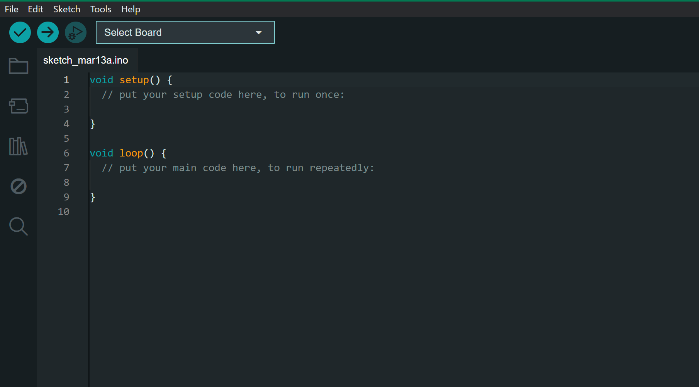
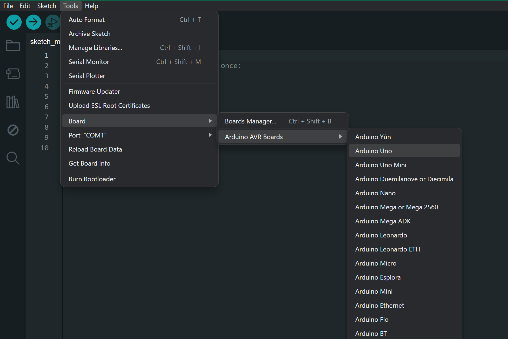
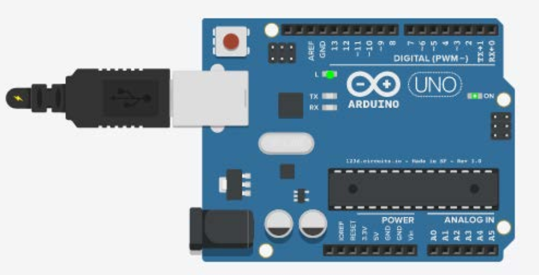

# Практическая часть 

## Знакомство со средой разработки Arduino IDE. Установка и начало работы

## Цель: познакомиться со средой разработки Arduino IDE, научиться осуществлять настройку ПО перед началом работы

## Теоретические сведения
Arduino (Ардуино) — аппаратная вычислительная платформа, основными компонентами которой является плата ввода-вывода и среда разработки.

Алгоритм — набор последовательных действий/команд, соблюдающих логичный порядок, который позволяет решать какие-либо задачи.

Для графического представления алгоритмов используются, так называемые блок-схемы.

Блок-схемы — это графическое представление алгоритма, состоящее из набора геометрических фигур.

Алгоритмы бывают нескольких типов: линейные, циклические, разветвляющиеся

Среда разработки Arduino IDE — в основу языка программирования
в данной среде положен C++ — один из самых популярных языков программирования

## Задание: установить среду разработки Arduino IDE, настроить оборудование перед началом работы.

1. Для начала зайдем на официальный сайт проекта Arduino в Интернете по адресу www.arduino.cc/en/Main/Software. Для того, чтобы скачать инсталлятор. Выберем в разделе Download the Arduino IDE вариант
Windows Installer, затем нажмите JUST DOWNLOAD
<p align="center">
<br>
Рисунок 1 – Окно скачивания программы Arduino IDE
</p>

<p align="center">
<br>
Рисунок 2 –  Кнопка загрузки установочного файла Arduino IDE
</p>

2. После загрузки файла arduino-ide_2.3.4-windows.exe запустите его с административными полномочиями, примите условия лицензионного соглашения и принимайте последующие варианты установки.
Установщик будет предлагать установить драйвера порта, на что следует отвечать утвердительно.

3. После установки запустите на рабочем столе ярлык Arduino.exe. При запуске появится окно, в котором содержится заготовка программы. В окне имеется заготовка, которая состоит из функций setup и
loop. Функция setup содержит команды, выполняемые одни раз при включении — это так называемые настройки программы. A loop включает в себя основную программу. Она выполняется бесконечное число раз, до тех пор, пока мы не отключим питание.

<p align="center">
<br>
Рисунок 4 – Окно Arduino IDE 
</p>

4. Для подключения контроллера используются USB-кабели. Подключите контроллер Arduino к компьютеру кабелем. После того как физический контакт ПК с контроллером установлен, нужно установить связи
между ним и средой разработки Arduino IDE. Для этого необходимо вы-брать номер порт. Если портов много, рекомендуется запомнить все имеющиеся, а затем физически отсоединить Arduino от кабеля, и снова проанализировать список портов, — тот, который исчез, и есть нужный. Далее установите флажок на нужном порте

<p align="center">
<br>
Рисунок 6 – Выбор нужного порта
</p>

Затем необходимо выбирать тип контроллера Arduino. На рисунке 7  можно видеть, что выбран Arduino/ Genuino Uno

<p align="center">
<br>
Рисунок 7 – Выбор нужного порта
</p>

5. Настройка закончена. Чтобы загрузить программу необходимо нажать кнопку . Оболочка проверит программу на
наличие ошибок, а затем переведет ее в двоичный код данных и команд  выбранного микроконтроллера и запишет в Arduino.

6. В качестве примера, заставим Arduino мигать встроенным светодиодом на 13-м порту

Диод — это электронный элемент, который пропускает электрический ток, только в одном направлении.

Светодиод — это диод, который начинает светиться при протекании по нему тока. На плате контроллера Arduino, как правило, уже установлен один светодиод — на 13-м порту (ножке)

```cpp
void setup(){ // настройка
    pinMode (13, OUTPUT); // перевод 13-го порта в состояние вывода информации
}
void loop(){ // основная программа
    digitalWrite (13, 1); // включение светодиода на плате
    delay (1000);// задержка в 1 секунду
    digitalWrite (13,0); // выключение светодиода на плате
    delay (1000);// задержка в 1 секунду
}
```

Аналогичным образом перепишем программу и загрузим ее в микроконтроллер. На выходе получим мигающий на плате светодиод с задержкой в 1 секунду

<p align="center">
<br>
Рисунок 7 – Результат работы светодиода (L — светодиод)
</p>

Для подключения монитора порта, необходимо открыть вкладку Инструменты | Монитор порта и скорректировать скорость порта (9600 бод) — в окне Монитор порта скорость задается в правом нижнем углу выбором из всплывающего списка
Команда Serial.println( ) передает с контроллера на ПК значение, указанное в скобках.

## Самостоятельная работа

Измените код программы так, чтобы светодиод мигал с каждым разом быстрее в течении 10 секунд, путем добавления команд digitalWrite() и delay ()
Ответ 
```cpp

```