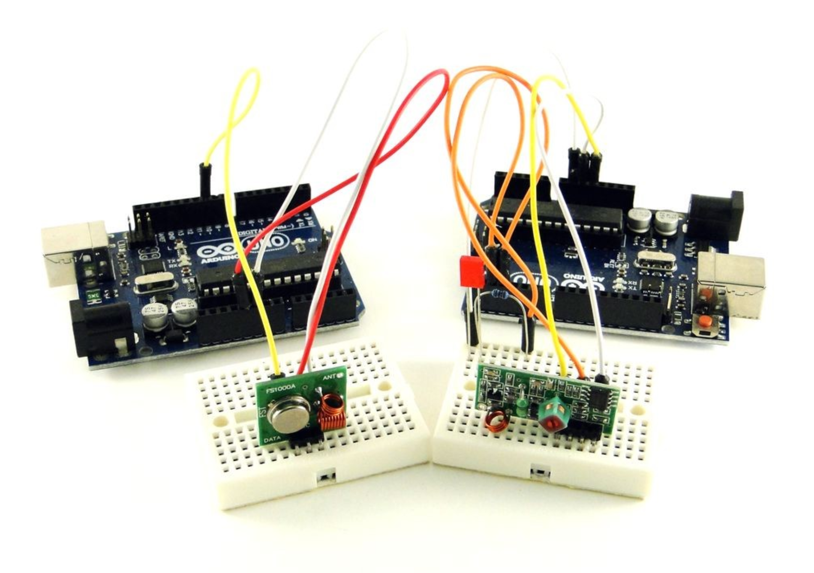
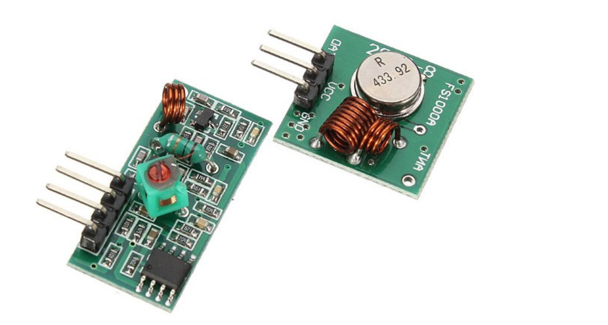
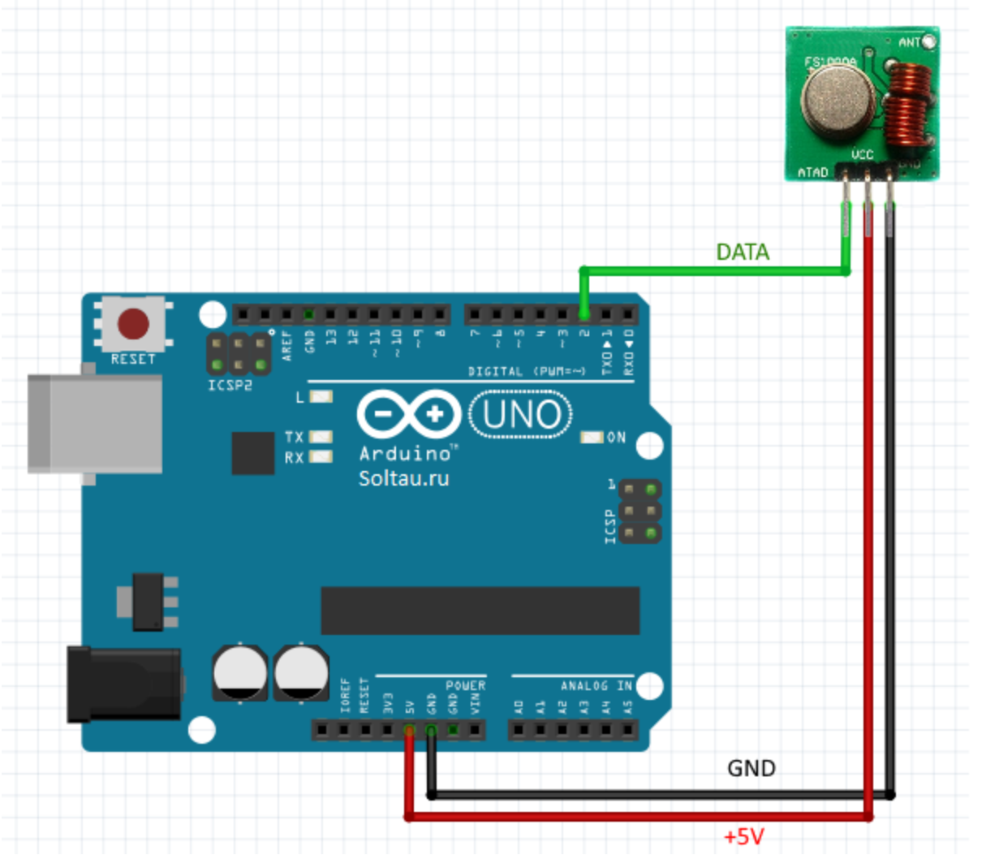
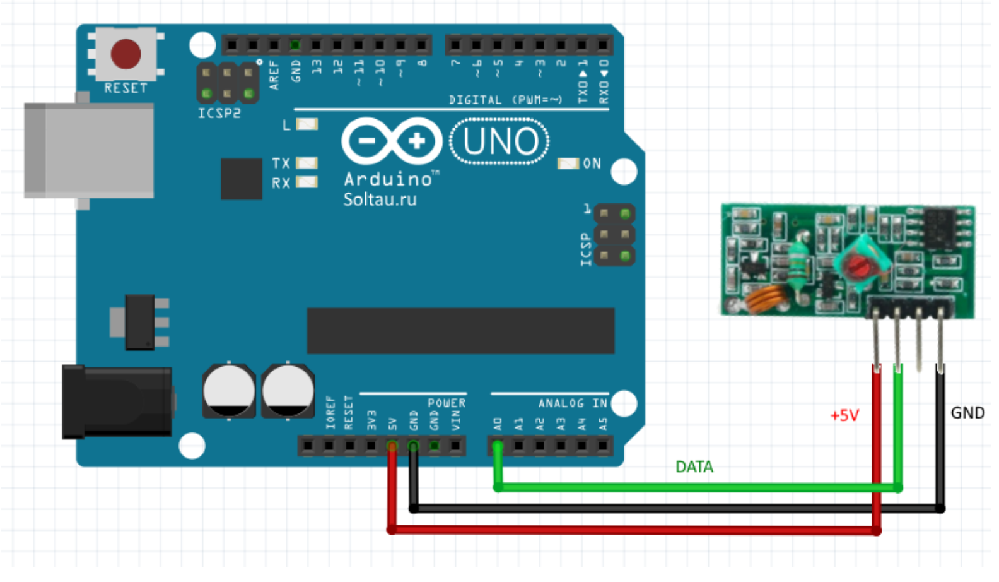

# Практическое занятие №N
# Подключение радиомодуля XY-MK-5V / FS1000A к Arduino
<p align="center">
<br>
    </p>

## Описание 
Эта пара отличается очень низкой стоимостью, при этом имеет весьма неплохой радиус передачи (около 50-ти метров в условиях города). Радиопередатчик FS1000A и радиоприёмник XY-MK-5V должны работать на одной частоте. «Из коробки» они настроены на несущую частоту 433 МГц. Это распространённая частота для радиосвязи. Например, она используется для связи домашней метеостанцией типа Oregon Scientific с выносными метеодатчиками (мы к ним ещё вернёмся), в некоторых системах автоматического управления воротами, и в других «умных» приборах и системах, передающих данные «по воздуху». 

<p align="center">
<br>
Рисунок 1 – Внешний вид приёмника XY-MK-5V и передатчика FS1000A 
</p>

## Подключение к Arduino 

Прежде чем подключать передатчик FS1000A к Arduino, необходимо к контактной площадке, обозначенной на плате ANT, припаять отрезок провода сечением примерно 0,25…0,5 мм и длиной 17,3 см. Это будет антенной.

```
Частоте 433 МГц соответствует длина волны, равная примерно 69 см.
При длине антенны, равной 1/4 от длины волны, волновой вибратор (антенна) находится в резонансе с длиной волны, и её эффективность максимальна. 
Отсюда число 17,3 см (= 69 / 4).
```
Передатчик FS1000A можно запитать напряжением от 3,3 до 12 В. В зависимости от поданного напряжения дальность передачи может несколько меняться: при большем напряжении – большая дальность. Мы подадим на передатчик напряжение 5 В, и остальные выводы подключим согласно схеме.

<p align="center">
<br>
Рисунок 2 – Схема подключения передатчика FS1000A к Arduino
</p>

Приёмник XY-MK-5V подключается тоже просто. Вывод "DATA" на модуле сдвоен, можно подключаться к любой из двух ножек. Питание также подадим 5 В от платы Arduino.
<p align="center">
<br>
Рисунок 3 – Схема подключения приёмника XY-MK-5V к Arduino
</p>

## Пример простейшей передачи данных по радиоканалу с помощью Arduino 

Особенностью радиопередачи является то, что длительные сигналы одного уровня передавать невозможно, передача будет срываться. Для более-менее устойчивой передачи необходимо передавать переменный сигнал. Причём необходимо каким-то образом выделять полезный сигнал из шума, который всегда присутствует в радиоэфире.

Для первого эксперимента возьмём стандартный скетч мигания светодиодом Blink и немного модифицируем его: каждые 5 секунд будем посылать команду с одного Arduino (передатчика) к другому (приёмнику). По принятии команды приёмник будет либо зажигать светодиод, если он погашен, либо гасить. То есть каждые 5 секунд приёмник будет менять своё состояние по принятой команде. Сделать это немного сложнее, чем кажется, ведь нам нужно выделить команду из постоянно присутствующего в эфире шума. 

Первый скетч – для передатчика. Он довольно простой.

```cpp
#define prd 4 // пин DATA передатчика FS1000A 
#define ledPin 13 // вывод встроенного светодиода Arduino

void setup() {
  pinMode(ledPin, OUTPUT); 
  pinMode(prd, OUTPUT); 
}

void loop() {
  sendCommand(); // отправляем команду
  delay(5000); // делаем задержку на 5 сек
}

// посылает команду в эфир 
void sendCommand() {
  digitalWrite(ledPin, HIGH); // на время отправки команды зажигаем встроенный светодиод
  // команда представляет собой три импульса наподобие «тире-точка-тире»
  digitalWrite(prd, HIGH);
  delay(100); 
  digitalWrite(prd, LOW);
  delay(50); 
  digitalWrite(prd, HIGH);
  delay(50); 
  digitalWrite(prd, LOW);
  delay(50); 
  digitalWrite(prd, HIGH);
  delay(100); 
  digitalWrite(prd, LOW);
  delay(50); 
  digitalWrite(ledPin, LOW);  // по окончании передачи команды гасим светодиод
}
```

Скетч для приёмника, ввиду описанных выше причин, сложнее. Поэтому для начала давайте просто периодически читать данные на входе приёмника и выводить то, что принимаем, в последовательный порт.

```cpp
#define prm 2 // пин DATA приёмника XY-MK-5V
#define ledPin 13 // встроенный светодиод

void setup() {
  Serial.begin(9600);
  pinMode(ledPin, OUTPUT);
}

void loop() {
  int data = digitalRead(prm); // читаем данные с входа приёмника
  Serial.println(data);
  delay(10);
}
```

```cpp
const int prm = 2; // пин входа приёмника XY-MK-5V
const int ledPin = 13; // пин встроенного светодиода Arduino
const int len = 14; // длина массивов

bool state = false; // текущее состояние светодиода
int pattern[len] = {1,1,0,1,0,1,1,0,0,0,0,0,0,0}; // эталонный массив - маска команды, которую нужно «словить»
int testReg[len] = {0,0,0,0,0,0,0,0,0,0,0,0,0,0}; // тестовый регистр - массив оцифрованных значений с входа приёмника

void setup() {
  pinMode(ledPin, OUTPUT);
  digitalWrite(ledPin, LOW);
}

void loop() {
  int data = digitalRead(prm); // читаем значение на входе приёмника
  ShiftReg(data, testReg); // вдвигаем полученное число в тестовый регистр
  if (IsCommandDetected(testReg, pattern)) { // проверяем, нет ли в тестовом регистре искомой последовательности
    state = !state; // если есть, меняем состояние светодиода
    digitalWrite(ledPin, state);
  }
  delay(50); 
}

// вдвигает в тестовый регистр новое значение
void ShiftReg(int newVal, int *arr) {
  for (int i = len - 1; i > 0; i--) {
    arr[i] = arr[i - 1]; // смещаем значения в регистре на 1 позицию вправо
  }
  arr[0] = newVal; // первую позицию заменяем только что принятым измерением
}

// проверяет, обнаружена ли команда на входе приёмника
bool IsCommandDetected(const int *testReg, const int *pattern) {
  for (int i = 0; i < len; i++) {
    if (testReg[i] != pattern[i]) { // почленно сравниваем 2 массива
      return false;
    }
  }
  return true;
}
```
Функция ShiftReg() получает на вход два аргумента: текущее содержимое тестового регистра и последнее полученное со входа приёмника значение. Она сдвигает все значения в регистре на 1 позицию, а в младший разряд регистра помещает текущее принятое значение. Таким образом, в регистре постоянно хранятся 16 (в данном конкретном случае) последних считанных с приёмника значений. Если мы посмотрим как меняется содержимое регистра, которое формируется функцией ShiftReg(), то увидим примерно следующее:
```
0000000000000000
0000000000000001
0000000000000010
0000000000000100
0000000000001000
0000000000010000
0000000000100001
0000000001000010
0000000010000101
0000000100001010
0000001000010101
0000010000101010
0000100001010101
0001000010101010
0010000101010100
0100001010101001
1000010101010010
0000101010100101
0001010101001010
0010101010010101
0101010100101010
1010101001010101
0101010010101011
1010100101010110
0101001010101101
1010010101011010
0100101010110101
1001010101101010
0010101011010101
0101010110101010
1010101101010101
0101011010101011
1010110101010110
0101101010101101
1011010101011010
0110101010110101
1101010101101010
1010101011010101
0101010110101010
1010101101010100
0101011010101000
1010110101010000
0101101010100001
1011010101000010
0110101010000101
1101010100001010
1010101000010101
0101010000101010
1010100001010101
0101000010101010
1010000101010100
0100001010101001
1000010101010010
```

## Заключение
Итак, теперь мы знаем простой и недорогой способ передавать данные на расстоянии. К сожалению, скорость передачи и дистанция в таких радиомодулях весьма ограничены, так что мы не сможем полноценно управлять, например квадрокоптером. Однако, сделать радиопульт для управления простым бытовым прибором: светильником, вентилятором или телевизором, нам под силу.

На основе приемопередатчиков с частотой 433 МГц и 315 МГц работает большинство радиоканальных пультов управления. Имея Ардуино и приемник, мы можем декодировать сигналы управления и повторить их.
